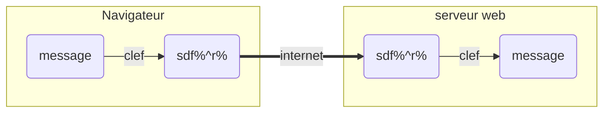
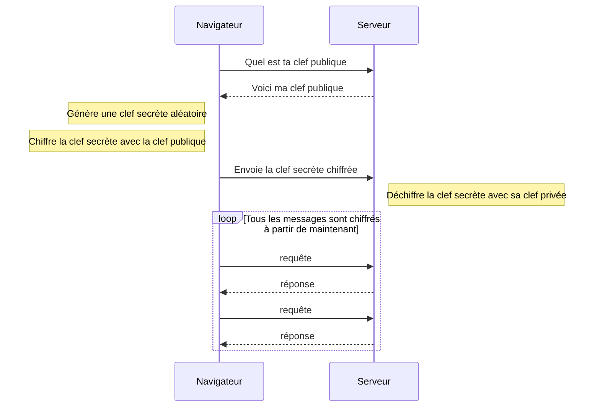
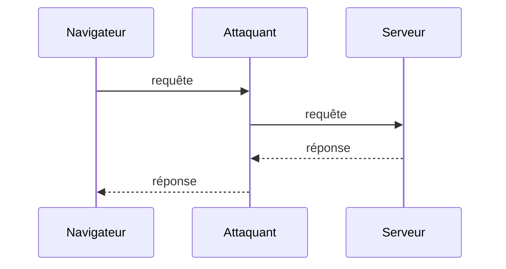
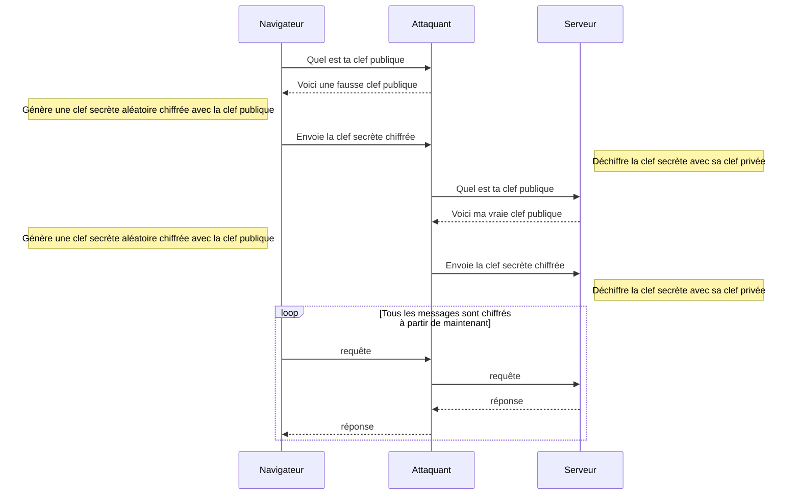

# Comprendre TLS quand on y connaît vraiment rien

- [Comprendre TLS quand on y connaît vraiment rien](#comprendre-tls-quand-on-y-connaît-vraiment-rien)
  - [Notions couvertes](#notions-couvertes)
  - [Les problèmes de sécurité du réseau Internet](#les-problèmes-de-sécurité-du-réseau-internet)
  - [Introduction](#introduction)
  - [La cryptographie à la rescousse](#la-cryptographie-à-la-rescousse)
  - [Un secret bien gardé à partager](#un-secret-bien-gardé-à-partager)
  - [Un sentiment d'asymétrie](#un-sentiment-dasymétrie)
  - [La Terre du Milieu](#la-terre-du-milieu)
  - ["Papier, s'il vous plaît !"](#papier-sil-vous-plaît-)

## Notions couvertes

Le but de cet article est de tenter une explication de la sécurisation par SSL/TLS, sans rentrer dans les détails mathématiques de la cryptographie.

## Les problèmes de sécurité du réseau Internet

Internet n'est pas né avec une sécurité intégrée. Lors de sa création, le réseau était considéré comme étant de confiance. Comme nous l'avons vu avec l'article sur le routage IP, Internet est par design totalement décentralisé et chaque routeur qui rejoint le réseau vient ajouter des l’interconnections supplémentaires.

Voici deux exemples d'attaques les plus simples permettant de se rendre compte de l’ampleur du problème:

- _Usurpation ARP_ : Sur un réseau commuté (derrière un **switch**), lorsqu'un paquet arrive, le switch va demander qui est le propriétaire de cette adresse en utilisant le protocole ARP. Si un attaquant arrive à répondre plus rapidement que la cible, il peut se faire envoyer les paquets qui ne lui sont théoriquement pas destiné

- _Usurpation DNS_ : Lorsqu'une cible demande une résolution de nom, il va émettre un paquet UDP et attendre la réponse du serveur DNS. Si un attaquant arrive à envoyer une réponse correcte plus rapidement en se faisant passer pour le serveur DNS, la cible recevra une adresse IP erronée. La cible sera persuadée d'envoyer ses paquets au serveur avec une IP correspondant au nom de domaine désiré.

En réalité ces attaques sont simplistes et il est facile de s'en prémunir. Mais ça démontre la sensibilité de la décentralisation aux attaques, et il existe encore aujourd’hui un grand nombre d'attaques valides, sans parler du _social engineering_ qui a de très beau jours devant lui.

## Introduction

Nous allons prendre comme exemple le cas d'un échange de données entre un navigateur internet et un serveur web.

Je vais essayer de décrire la démarche de pensée qui a permet d'imaginer le système TLS et des Autorités de Confiance (_CA_) tel que nous le connaissons aujourd'hui.

## La cryptographie à la rescousse

La cryptographie est un champ de recherche immense et on sait aujourd'hui chiffrer des données de manière presque indéchiffrable pour un attaquant.Aujourd'hui, un algorithme tel que `AES` (pour _Advanced Encryption Standard_) est réputé presque inviolable.

`AES` est très simple dans sa mise en œuvre : le navigateur chiffre tous ses paquets avec une clef : une suite aléatoire de bits d'une taille fixe (actuellement 128, 192 ou 256 bits). Le serveur web utilise la même clef pour déchiffrer le message, et pour chiffrer les paquets en retour.

Même si un attaquant arrive à détourner la totalité des paquets, il sera théoriquement impossible pour lui de retrouver le message original sans la clef qui a servi au chiffrement ! Il semble que le problème soit résolu, il suffit de chiffrer en AES tous les échanges du monde ! Problème résolu !

  Mais...

## Un secret bien gardé à partager

Nous savons que `AES` est suffisant et théoriquement invulnérable d'un point de vue cryptographique. Mais cette affirmation n'est vraie que si les 2 parties (le client et le serveur web) partage **secrètement la même clef**.

La première question va donc être : **comment partager la clef** avant de commencer à chiffrer le premier message ?

Et sans oublier que chaque clef doit être **unique** par navigateur et par serveur web. Car nous ne voulons pas qu'un autre navigateur ou que le propriétaire d'un serveur web puisse déchiffrer les messages d'un échange entre un autre navigateur et un autre serveur web.

On peut donc reformuler la problématique par une phrase: **Comment échanger un secret entre 2 entités distante ?**

## Un sentiment d'asymétrie

De part l'aspect dynamique et décentraliser d'Internet, il n'existe qu'une seule voie possible. Il faut trouver un moyen d'échanger une clef secrète à la première connexion avec le serveur web.

C'est un autre algorithme issu des recherches cryptographique qui va apporter une première solution : les algorithme de chiffrement asymétrique, comme par exemple `RSA`. On les appelle également les algorithmes à clef privée et clef publique. Ces algorithmes sont en revanche tellement coûteux en puissance de calcul qu'ils ne permettent que de chiffrer des très petites quantité de données.

Sans rentrer dans les détails mathématiques, il faut juste retenir que pour établir un échange, on génère un couple de clefs. **Si un message est chiffré par une clef, il ne peut être déchiffrer que par l'autre clef**, et inversement.

Cette asymétrie publique/privée va nous aider à échanger une clef secrète de façon sécurisé:

1. Le propriétaire du serveur web créer de son coté **une paire de clef** asymétriques
2. Il garde une des deux clefs pour lui, elle ne doit pas être divulguée, c'est la **clef secrète**.
3. La seconde clef est offerte aux yeux de tous, c'est la **clef publique**.
4. Un navigateur souhaitant échanger des messages avec le serveur web génère une clef `AES` totalement **aléatoire**.
5. Le navigateur demande la clef publique au serveur web
6. Le navigateur **chiffre la clef secrète** avec la clef publique et l'envoie au serveur web.
7. Le serveur web reçoit la clef chiffré qu'il **déchiffre avec sa clef privée**.
8. Le navigateur et le serveur web possède maintenant chacun la clef secrète

Grâce à ce mini-algorithme, un navigateur peut se connecter sur n'importe quel serveur web, récupérer sa clef publique et ensuite commencer à échanger des clef secrètes. Il y a même un conséquence intéressante du point de vue de la sécurité : on peut régénérer la clef secrète autant de fois que nécessaire.

Tout attaquant qui serait capable de lire tous les échange entre le navigateur et le serveur serait incapable d'en déduire la clef, ni de déchiffrer les messages.

Malheureusement le problème n'est pas encore totalement résolu car il existe une célèbre attaque qui vient affaiblir notre nouvel algorithme.

## La Terre du Milieu

Certaines attaques sur le réseau peuvent permettre à un attaquant d'intercepter du traffic qui ne lui est pas destiné, mais certaines attaques permettent également à un attaquant de se faire passer pour un autre nœud du réseau.

Par exemple, lorsqu'un navigateur envoie des paquets au serveur web, un attaquant pourrait être en mesure de rediriger les paquets vers lui sans que le navigateur n'en soit conscient. Pour parfaire l'illusion, l'attaquant peut se connecter en même temps au vrai serveur web et renvoyer à la victime des vraies réponses à ses requêtes. Cette attaque est appeler **l'attaque de l'homme du milieu** (HDM) ou _man-in-the-middle attack_ (MITM).

Cette attaque est très pratique pour un attaquant car il aura accès à tous les messages échangés et il peut être en mesure de falsifier les messages en modifiant leur contenu. Dans cette configuration, ni le navigateur, ni le serveur web ne peuvent déceler formellement la supercherie.

Prenons le cas d'une attaque de l'homme du milieu sur un échange non sécurisé:

Lors de l'établissement d'un échange de clef secrète par clef asymétrique, la sécurité n'est pas du tout assurée, puisque le navigateur va partagé sa clef avec l'attaquant, qui lui-même partagera sa propre clef avec le navigateur web :

Nous allons donc reformuler à nouveau la problématique par une phrase: **Comment être sûr de l'identité de l'entité réseau avec qui on va échanger une clef secrète?**

## "Papier, s'il vous plaît !"

Tous nos beaux efforts sont donc réduits à néant par une simple question de design : dans un réseau décentralisé sans autorité centrale, il n'existera jamais de garantie que celui qui recevra nos messages est bien celui qu'on pense !
