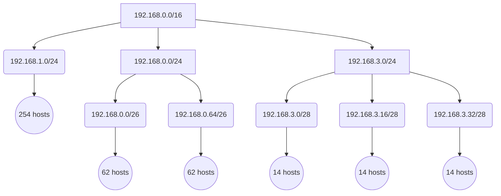
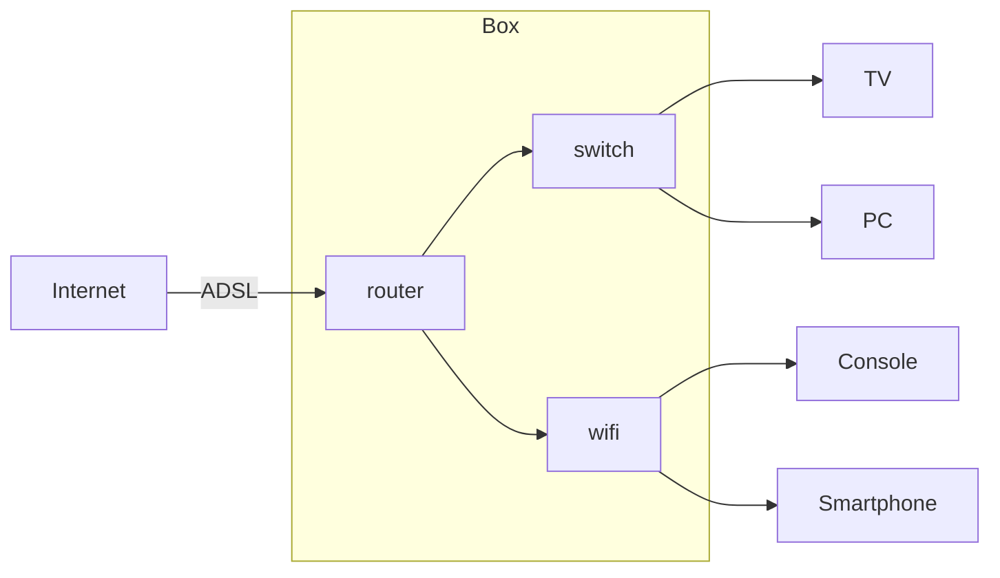

# Comprendre le protocole IP quand on est pas un administrateur réseau.

- [Comprendre le protocole IP quand on est pas un administrateur réseau.](#comprendre-le-protocole-ip-quand-on-est-pas-un-administrateur-réseau)
  - [Introduction](#introduction)
  - [Description d'un système postal simplifié](#description-dun-système-postal-simplifié)
    - [Remise de courrier simple](#remise-de-courrier-simple)
    - [Centralisation par départements](#centralisation-par-départements)
    - [Acheminement du courrier de proche en proche](#acheminement-du-courrier-de-proche-en-proche)
    - [Le cas spécial des départements d'outre-mer](#le-cas-spécial-des-départements-doutre-mer)
  - [L'adresse IP (Internet Protocol)](#ladresse-ip-internet-protocol)
    - [Les paquets IP](#les-paquets-ip)
    - [Le format de l'adresse IP](#le-format-de-ladresse-ip)
    - [Une adresse IP contient deux informations](#une-adresse-ip-contient-deux-informations)
    - [Le masque de sous-réseau](#le-masque-de-sous-réseau)
    - [La notation CIDR](#la-notation-cidr)
    - [Organisation en sous-réseaux](#organisation-en-sous-réseaux)
    - [Adresses particulières](#adresses-particulières)
  - [Switchs et routeurs](#switchs-et-routeurs)
    - [Les nœuds périphériques du réseau](#les-nœuds-périphériques-du-réseau)
    - [Configuration des appareils](#configuration-des-appareils)
    - [Configuration des switchs](#configuration-des-switchs)
    - [Configuration des routeurs](#configuration-des-routeurs)
    - [Les paquets spéciaux ICMP](#les-paquets-spéciaux-icmp)
    - [Le _Time To Live_](#le-time-to-live)
    - [Exemple d'architecture réseau](#exemple-darchitecture-réseau)
  - [Questions pratiques de la vie de tous les jours](#questions-pratiques-de-la-vie-de-tous-les-jours)
    - [La commande `ping` me répond correctement, pourtant le site web semble inaccessible](#la-commande-ping-me-répond-correctement-pourtant-le-site-web-semble-inaccessible)
    - [Pourquoi dit-on que Internet est décentralisé et robuste ?](#pourquoi-dit-on-que-internet-est-décentralisé-et-robuste-)
    - [Ma box internet, c'est un switch ou un routeur?](#ma-box-internet-cest-un-switch-ou-un-routeur)
    - [J'ai un nouveau PC, mais je ne sais jamais quoi mettre dans "Masque de sous-réseau" et "Passerelle par défaut"](#jai-un-nouveau-pc-mais-je-ne-sais-jamais-quoi-mettre-dans-masque-de-sous-réseau-et-passerelle-par-défaut)
  - [Conclusion](#conclusion)

## Introduction

Alors que la plupart ne sont pas des experts réseau, il arrive souvent aux développeurs d'application de devoir envoyer ou recevoir des données sur le réseau. La plupart du temps, la seule connaissance nécessaire est de savoir ouvrir un `socket` réseau. Mais en cas de problème, un novice sera démuni pour comprendre un message d'erreur ou vérifier la configuration d'un serveur.

La plupart des cours qu'on peut trouver sur Internet se concentrent un peu trop sur l'aspect technique, comme la manipulation de _bits_, la spécification des _headers_ ou la définition des couches _OSI_... Je suis persuadé qu'il est possible de saisir le fonctionnement général d'un réseau IP sans avoir besoin de savoir d'entrer dans les arcanes des cartes réseaux.

Avec ces quelques explications, vous serez mieux préparés pour discuter avec un expert réseau ou mieux comprendre certains messages d'erreurs renvoyés par votre application.

Dans cet article, nous allons donc essayer de répondre simplement à des questions comme :

- _Quand je tape la commande `ping`, qu'est-ce que je teste en réalité ?_
- _Pourquoi dit-on que Internet est décentralisé et robuste ?_
- _Ma box internet, c'est un switch ou un routeur?_
- _J'ai un nouveau PC, mais je ne sais jamais quoi mettre dans "Adresse de sous-réseau" et "Passerelle par defaut" !!!_

## Description d'un système postal simplifié

> Avertissement : Le système postal que nous allons décrire ici est imaginé à des fins **pédagogiques**. Bien que ressemblant au vrai système postal, il est totalement **fictif**. Si le sujet vous intéresse, je vous invite à consulter la page Wikipedia <https://fr.wikipedia.org/wiki/Code_postal_en_France>.

> J'imagine également que certaines de mes analogies vont faire sauter au plafond les puristes des couches OSI et autres administrateurs réseau, mais souvenez-vous que pour vulgariser, on est bien obliger d'éluder certaines vérités trop complexes !

Pour comprendre la remise d'un paquet d'un ordinateur à un autre, nous pouvons le comparer à la remise d'un courrier par le service postal.

Nous allons donc imaginer la mise en place d'un service postal fictif simplifié à l'extrême. Pour cela nous imaginons qu'il n'y a qu'une seule boite au lettre par commune,et nous allons étudier comment une commune peut envoyer un courrier à une autre commune. Nous oublions totalement le reste de l'adresse qui ne nous intéresse pas pour l'exemple.

Imaginons une personne qui doit envoyer un courrier depuis Saint-Médard-en-Jalles (`33160`) vers Démuin (`80110`). Le courrier est d'abord être déposé dans la boite aux lettres de la commune où il sera pris en charge par le système postal qui sera en charge de l'acheminer dans la boite aux lettres de la commune de destination.

De plus, un code postal est constitué d'un numéro de département par ses 2 premiers chiffres, puis d'un identifiant de commune sur les 3 derniers chiffres.

| Commune                | Code postal | Département | Identifiant de commune |
| ---------------------- | ----------- | ----------- | ---------------------- |
| Saint-Médard-en-Jalles | `33160`     | `33`        | `160`                  |
| Démuin                 | `80110`     | `80`        | `110`                  |

Sur l'enveloppe au départ de Saint-Médard-en-Jalles, nous indiquons simplement le code postal de la commune de destination, et au dos nous écrivons notre propre code postal pour que le destinataire puisse nous répondre.

Exemple de courrier à envoyer :

|              | Commune                | Code postal |
| ------------ | ---------------------- | ----------- |
| Expéditeur   | Saint-Médard-en-Jalles | 33160       |
| Destinataire | Démuin                 | 80110       |

### Remise de courrier simple

Voici donc notre premier algorithme sans aucune contrainte :

1. Je dépose l'enveloppe dans la boite aux lettres de Saint-Médard-en-Jalles
2. Un facteur récupère l'enveloppe et la transporte jusqu'à la boite aux lettres de Démuin
3. Mon destinataire récupère l'enveloppe dans la boite aux lettres de Démuin

Voici le trajet qui sera effectué par notre courrier :


Cet algorithme n'est pas optimal, car il faut effectuer **autant de trajet qu'il y a de courriers à remettre**.

### Centralisation par départements

Pour optimiser la remise de nos courriers, nous allons découper la France en départements, et chaque département disposera d'un "bureau distributeur" en charge de récupérer tous les courriers en partance de son département. Cette première étape permettra de rassembler tous les courriers du département pour les trier selon leur destination, et pouvoir ainsi grouper les courriers que l'on doit emmener même bureau distributeur de destination.

Pour faciliter la numérotation, la commune du bureau distributeur aura un code postal un peu spécial composé du numéro du département puis de `000`.

Une fois le courrier au bureau distributeur, il existe 2 choix :

- Si le destinataire est dans le même département, alors le courrier lui est directement remis
- Si le destinataire est dans un autre département, alors le courrier est remis au bureau distributeur du département dans lequel se trouve le destinataire.

Avec ces nouveaux éléments, l'algorithme est modifié:

1. Je dépose l'enveloppe dans la boite aux lettres de Saint-Médard-en-Jalles
2. Un facteur récupère l'enveloppe et la transporte jusqu'au bureau distributeur du département
3. Un facteur récupère l'enveloppe au bureau distributeur
4. Mon destinataire récupère l'enveloppe dans la boite aux lettres de Démuin

Voici le nouveau trajet effectué par le courrier :


Voici la liste des nouveaux codes postaux traversés :

|                     | Commune                | Code postal |
| ------------------- | ---------------------- | ----------- |
| Expéditeur          | Saint-Médard-en-Jalles | `33160`     |
| Bureau Gironde (33) | Bordeaux               | `33000`     |
| Bureau Sommes (80)  | Amiens                 | `80000`     |
| Destinataire        | Démuin                 | `80110`     |

Si on regarde l'algorithme du point de vue des codes postaux :

1. L’expéditeur dépose le courrier en partance dans la boite aux lettres `33160`
2. Le courrier est automatiquement acheminé dans la boite aux lettres `33000`
3. Lors du tri du courrier, on extrait le département destinataire et on calcule le code postal du département `80` à partir du code postal du destinataire `80110`, et en fait transiter le courrier jusqu'à la boite aux lettres `80` + `000` = `80000`
4. Le courrier est ensuite acheminé de la boite `80000` vers la boite destinataire `80110`

> Dans l'analogie avec un réseau IP, un bureau distributeur est ce qu'on appellera un **commutateur** (ou _switch_).

### Acheminement du courrier de proche en proche

Dans cette nouvelle version de notre système postal, nous allons maintenant considérer que les bureaux distributeurs vont pouvoir remettre du courrier aux bureaux distributeurs de leurs **départements limitrophes**, qui devront à leur tour transporter le courrier à un autre département limitrophe. Le courrier finira par arriver au bureau distributeur de destination en traversant chaque département de proche en proche.

Avec ce système, les bureaux distributeurs ne sont plus des simples centralisateurs, mais deviennent des membres actif du réseau postal dans son ensemble. Chaque bureau distributeur doit alors trier les courriers provenant de son propre département mais aussi les courriers en "transit" en provenance des autres département.

Parcours de notre courrier avec la nouvelle contrainte :


Ce mécanisme semble avoir beaucoup d'avantages, car les bureaux distributeurs n'ont plus besoin de connaître l'ensemble des départements, mais il a un inconvénient **majeur** : comment savoir vers quel département suivant envoyer le courrier pour qu'il finisse par arriver au bon département de destination ? Et comment faire en sorte que ce parcours soit optimal, sans traverser des départements inutiles, ni créer des boucles ?

Pour que le système fonctionne, chaque bureau distributeur doit recevoir un "tableau des redirections" **pré-calculé** de tous les départements possibles associé avec le département limitrophe vers lequel envoyer le courrier. Ainsi, lorsqu'un bureau distributeur reçoit un courrier, il lit le code postal de destination, en déduit le département de destination puis cherche dans le tableau le prochain département vers lequel faire transiter ce courrier.

Exemple de tableau des redirections attribué au département `33` :

| Département destinataire | Département de transit |
| ------------------------ | ---------------------- |
| `85`                     | `17`                   |
| `79`                     | `24`                   |
| `86`                     | `16`                   |
| `16`                     | `16`                   |
| `87`                     | `24`                   |
| `19`                     | `24`                   |
| `24`                     | `24`                   |
| `46`                     | `24`                   |
| ...                      | ...                    |
| `80`                     | `24`                   |

Appliquons ce tableau à notre exemple : lors de l’expédition d'un courrier depuis le département `33` à destination du département `80`, on sait que le plus court chemin est par le département `24` donc on transmet le courrier au bureau distributeur du département `24`, qui le prendra en charge pour la suite.

Chaque département traversé possède donc son propre tableau optimisé des départements associé au département limitrophe vers lesquels envoyer le courrier. Si jamais un bureau d'un département était subitement fermé, le tableau des départements limitrophes serait alors recalculé. En France, il y a très souvent au moins 2 départements limitrophes, donc on peut facilement trouver un moyen de contourner le département fermé. De la même façon, on peut imaginer associer une préférence (un _poids_) à chaque route. Par exemple, un département montagneux pourra avoir un poids moins élevé qu'un département en plaine. L'algorithme prendra alors en compte ces paramètres afin de calculer le prochain département.

Avec cet algorithme de redirection de proche en proche :

1. L’expéditeur dépose le courrier en partance dans la boite aux lettres `33160`
2. Le courrier est automatiquement acheminé dans la boite aux lettres `33000`
3. On cherche dans la table de routage le meilleur département limitrophe pour `80110` : `80`->`24`, on envoie donc le courrier vers `24000`
4. Le courrier arrive à `24000` qui cherche dans sa table de routage : `80110` : `80`->`87` et envoie donc le courrier à `87000`
5. Chaque bureau distributeur de département envoie de proche en proche jusqu'au bureau destinataire `8000.`
6. Le courrier est ensuite acheminé de la boite `80000` vers la boite destinataire `80110`


Ce système de routage a beaucoup d'avantages :

- Une fois le tableau de redirection calculé, il n'y a pas besoin d'autorité centrale pour prendre les décisions d'itinéraire. Le système est ainsi extrêmement résiliant.
- Le système n'a pas besoin de l'historique de passage d'un courrier dans les différents département. Il passe à son voisin et l'oublie.
- L'enveloppe de courrier n'a pas besoin d'être modifiée pendant son parcours.
- Le système peut choisir plusieurs routes possibles pour une même destination, et il peut aussi s'adapter à l'ajout et la suppression de département intermédiaires.

> Dans l'analogie avec un réseau IP, celui qui redirige le courrier au département suivant est appelé un **routeur** (ou **router** en anglais).
> Dans notre analogie, les bureaux distributeurs font office à la fois de **commutateurs** et de **routeurs** mais dans les réseaux IP, ce sont des appareils différents comme nous le verrons dans le chapitre suivant.

### Le cas spécial des départements d'outre-mer

Lors du rattachement des départements d'outre-mer au système postal français, il s'est posé la question de l'attribution de nouveaux codes postaux à ces départements. Malheureusement, la France commençait à ne **plus avoir assez de numéros de département disponibles** ! Il aurait été possible modifier le système pour le faire passer sur 6 chiffres afin de pouvoir créer des numéros de département sur 3 chiffres, mais ce genre de changement est généralement très coûteux. Par chance, ces départements étaient généralement des petits territoires avec assez peu de communes.

Il a donc été trouvé une solution plus simple qui résolvait tous ces problèmes tout en gardant le code postal sur 5 chiffres :

1. **Réserver** le code `97` à l'ensemble des département d'outre-mer
2. **Augmenter à 3 chiffres le code du département, et "réduire" à 2 chiffres l'identifiant de la commune**. En faisant ce choix, nous gardons un code postal sur 5 chiffres, mais en contrepartie, nous sommes limités à identifier moins de 99 communes par département.

| Commune                | Code postal | Département | Commune |
| ---------------------- | ----------- | ----------- | ------- |
| Saint-Médard-en-Jalles | `33160`     | `33`        | `160`   |
| Démuin                 | `80110`     | `80`        | `110`   |
| Trois-Rivières         | `97114​`    | `971`       | `14`    |
| Saint-Paul             | `97460​`    | `974`       | `60`    |

Pour adapter ces nouveaux identifiants au système existant, c'est assez simple :

- Au niveau de chaque commune, on doit stocker un nouveau paramètre qui permet de calculer le centre distributeur du département.

| Code postal de la commune | Nombre de chiffre identifiant le département | Code postal du bureau distributeur |
| ------------------------- | -------------------------------------------- | ---------------------------------- |
| `33160`                   | 2                                            | `33000`                            |
| `80110`                   | 2                                            | `80000`                            |
| `97114​`                  | 3                                            | `97100`                            |
| `97460​`                  | 3                                            | `97400`                            |

- Au niveau des bureaux de distribution, on doit également connaître le nombre de chiffres à enlever pour connaître le département correspondant. L'algorithme lui ne change pas, il manipule uniquement des nombres plus grands.

| Code postal de la commune | Nombre de chiffre identifiant le département | Département |
| ------------------------- | -------------------------------------------- | ----------- |
| `33160`                   | 2                                            | `33`        |
| `80110`                   | 2                                            | `80`        |
| `97114​`                  | 3                                            | `971`       |
| `97460​`                  | 3                                            | `974`       |

> Dans l'analogie avec un réseau IP, le nombre de chiffre identifiant la commune est appelé un **masque de sous-réseau** (**subnet mask** ou **netmask** en anglais).

## L'adresse IP (Internet Protocol)

### Les paquets IP

Quand un appareil doit transférer des données à un autre appareil sur le réseau, la donnée sera d'abord découpée en petit morceaux appelés **paquets** (on parle aussi de **datagramme**). Chaque paquet aura des meta-données, aussi appelées **entête** du paquet.

Il faut donc imaginer les données comme des myriades de petits paquets qui ont chacun leur vie propre sur le réseau, puis qui seront reconstitué par l'appareil de destination.

Le protocole IP sera responsable d'acheminer les paquets unitairement et n'a pas la vision de la donnée complète. Chaque paquet est donc traité comme une donnée autonome sans contexte. Pour reconstituer la donnée complète, il faudra ajouter par dessus un protocole de plus haut niveau comme `TCP` ou `UDP` par exemple.

### Le format de l'adresse IP

Il peut y avoir une très grande quantité d'appareils sur le réseau et chaque appareil doit avoir une adresse unique, il faut donc que les adresses soit assez nombreuses pour qu'Internet puisse fonctionner.

Le protocole IP, qui signifie _Internet Protocol_ (que l'on pourrait traduire par _protocole inter-réseau_), est le protocole qui va permettre la remise d'un paquet de donnés à une adresse du réseau. Il existe aujourd'hui deux versions du protocoles IP : IPv4 et IPv6. Ces protocoles sont incompatibles entre eux, n'utilisent pas le même format d'adresse et qui ont des entêtes et un fonctionnement légèrement différent.

- Une adresse IP dans IPv4 est constituée de 32 bits et peut donc décrire $2^{32}$ addresses, soit à peu près 4 milliards, ce qui paraissait suffisant lors de sa création. Cependant avec tous les nouveaux usages, le nombre d'appareils connectés a explosé, menaçant même Internet de pénurie d'adresses disponibles.

- Une adresse IP dans IPv6 est constituée de 128 bits et peut donc décrire $2^{128}$ addresses, soit à peu près 340 sextillions. Ce protocole a été créé pour résoudre les limites de IPv4, et au passage lui ajouter quelques fonctionnalités, notamment pour augmenter la sécurité.

Plus complet (et plus complexe !), IPv6 est sensé remplacer IPv4 à terme, mais la migration est difficile car tout le matériel existant (routeurs, switchs, ...) doit être remplacé. De plus, ces deux protocoles ne sont pas compatibles entre eux, et la migration nécessite de mettre au point des **stratégies de cohabitation** qui ne sont pas toujours simples.

En attendant l'adoption complète de IPv6 pour tout Internet, il existe beaucoup de techniques qui permettent de **contourner les limites actuelles de IPv4**. La technique la plus répandue étant simplement de ne pas connecter des sous-réseaux entiers à Internet. Ces réseaux **privés** peuvent utiliser toute la puissance d'IP tout en s'affranchissant de ses limites tant que les paquets ne sortent pas du réseau. En contrepartie, il faudra user de techniques complexes et/ou limitées pour pouvoir communiquer avec le reste d'Internet (`Proxy`, `NAT`, etc...)

Pour faciliter la lecture, on utilise une représentation décimales pour IPv4 et hexadécimale pour les adresses IPv6.

| Type         | Exemple                                   |
| ------------ | ----------------------------------------- |
| Code postal  | `33160`                                   |
| Adresse IPv4 | `193.43.55.67`                            |
| Adresse IPv6 | `2001:0db8:0000:85a3:0000:0000:ac1f:8001` |

> **Pour des raisons de simplicité, nous continuerons les explication avec IPv4 uniquement**.
> Les notions restent très similaires pour IPv6.

### Une adresse IP contient deux informations

Exactement comme pour les codes postaux qui contiennent un numéro de département et un identifiant de commune, une adresse IP contient 2 informations :

- Le **sous-réseau** dans lequel se trouve l'appareil (équivalent du **département**)
- L'**identifiant** de l'appareil au sein de ce réseau (équivalent de l'**identifiant de commune**)

Comme pour le code postal, on peut choisir combien de chiffres allouer à chaque information.

Si on met côte à côte un code postal et une adresse IP, on peut faire un parallèle :

| Type                         | Adresse complète | Sous réseau   | Identifiant  |
| ---------------------------- | ---------------- | ------------- | ------------ |
| Code postal                  | `33160`          | `33000`       | `00160`      |
| Code postal d'Outre-mer      | `97114​`         | `97100`       | `00014​`     |
| Adresse IP d'un petit réseau | `193.43.55.67`   | `193.43.55.0` | `0.0.0.67`   |
| Adresse IP d'un grand réseau | `145.12.149.78`  | `145.12.0.0`  | `0.0.159.78` |


### Le masque de sous-réseau

Maintenant que l'on sait qu'une adresse IP est constitué de 2 informations, il faut un moyen de représenter cette information.

Pendant longtemps, pour retrouver l'adresse du réseau, on associait à l'adresse IP un **masque de sous réseau** que l'on représente sous le même format que l'adresse IP.
Dans cet notation, le **masque binaire** permet de retrouver l'adresse du réseau en appliquant un `AND` binaire :

```
       193      43       55       67
    11000001 00101011 00110111 01000011
AND
       255      255      255       0
    11111111 11111111 11111111 00000000
 =
       193      43       55        0
    11000001 00101011 00110111 00000000
```

Malheureusement, le calcul n'est pas aussi trivial qu'un code postal, car une adresse IP n'est pas constitué de chiffres décimaux, mais de **bits**. Les chiffres ne sont qu'une représentation texte plus facile à lire et écrire. Mais il faut se rappeler que le découpage est fait au niveau des bits !

```
       193      43       55       67
    11000001 00101011 00110111 01000011
AND
       255      240       0        0
    11111111 11110000 00000000 00000000
 =
       193      32        0        0
    11000001 00100000 00000000 00000000
```

Récapitulons ces 2 exemples en format décimal :

| Adresse IP   | Masque de sous réseau | Sous réseau |
| ------------ | --------------------- | ----------- |
| 192.43.55.67 | 255.255.255.0         | 192.43.55.0 |
| 192.43.55.67 | 255.240.0.0           | 192.32.0.0  |

Cette notation est très "proche" du fonctionnement interne, car pour trouver le réseau à partir de l'adresse, le processeur va appliquer une opération `AND` binaire. Mais il existe une représentation plus simple et plus concise : la notation **CIDR**.

### La notation CIDR

Heureusement, une notation plus compréhensible a été trouvée : le CIDR (_Classless Inter-Domain Routing_). Cette notation ajoute simplement un slash `/` suivi d'un nombre décimal indiquant le nombre de bit de l'adresse réseau à partir du début.

Reprenons le même exemple que précédemment mais avec la notation CIDR, l'adresse `193.43.55.67/24` :

```
<---------24 bits-------->
11000001 00101011 00110111 01000011
```

| Adresse CIDR    | Réseau      |
| --------------- | ----------- |
| 193.43.55.67/24 | 193.43.55.0 |
| 193.43.55.67/17 | 193.32.0.0  |
| 193.43.55.67/3  | 192.0.0.0   |


> Pour faire le parallèle avec le service postal, on pourrait dire que Saint-Médard-en-Jalles est à l'adresse `33160/2` alors que Trois-Rivières est à l'adresse `97114​/3`

Tous ces calculs peuvent être un peu fastidieux. Heureusement, on utilise un petit utilitaire nommé `ipcalc` qui nous évitera de faire ces calculs de tête et nous donnera toutes les informations nécessaires sur une adresse IP. Il prend en paramètre une adresse IP au format `CIDR`, ou une adresse IP et un masque de sous-réseau.

```bash
$ ipcalc 193.43.55.67/12
Address:   193.43.55.67         11000001.0010 1011.00110111.01000011
Netmask:   255.240.0.0 = 12     11111111.1111 0000.00000000.00000000
Wildcard:  0.15.255.255         00000000.0000 1111.11111111.11111111
=>
Network:   193.32.0.0/12        11000001.0010 0000.00000000.00000000
HostMin:   193.32.0.1           11000001.0010 0000.00000000.00000001
HostMax:   193.47.255.254       11000001.0010 1111.11111111.11111110
Broadcast: 193.47.255.255       11000001.0010 1111.11111111.11111111
Hosts/Net: 1048574               Class C
```

### Organisation en sous-réseaux

Contrairement aux départements, les sous-réseaux peuvent eux-mêmes êtres divisés en plusieurs sous-réseaux, qui eux-mêmes peuvent être divisés en sous-sous-réseaux, etc...

Si la notion de sous-réseau est finalement peu utile pour le développeur d'application, elle est en revanche cruciale pour l'architecte réseau. En effet, que ce soit dans le Cloud ou sur un réseau physique, l'architecte réseau va avoir à sa disposition un réseau qu'il faudra **découper** intelligemment. Par exemple, il faut créer suffisamment de sous-réseaux pour créer des règles d'accès fines (quel sous-réseau aura le droit d'aller vers internet, quel sous-réseau contiendra les bases de données, etc...) tout en gardant assez de "chiffres" disponibles pour pouvoir créer suffisamment d'adresses à l'intérieur de ces sous-réseaux.



De même il faut faire attention à ce que les réseaux ne se "chevauchent" pas, c'est à dire à être vigilant qu'une même adresse IP ne puisse pas appartenir à 2 réseaux différents.

Comme une adresse réseau est souvent le sous-réseau d'une autre adresse réseau, on utilise indifféremment les terme "réseau" et "sous-réseau" dans le langage courant.

### Adresses particulières

Lors de la définition d'un sous-réseau, il n'est pas possible d'utiliser la première et la dernière adresse du réseau:

- La première adresse est réservée pour désigner l'adresse du réseau lui-même. Exemple: ```192.168.1.0/24```
- La dernière adresse est réservée pour l'adresse dite de _broadcast_, qui permet d'envoyer le même paquet à tous les appareils du réseau. Exemple: ```192.168.1.255/24```

Lors de l'ouverture d'internet au monde, il a été également été décidé de réserver certaines adresses à des usages particuliers.

Ces [Adresses Spéciales](https://fr.wikipedia.org/wiki/Adresse_IP#Plages_d'adresses_IP_sp%C3%A9ciales) ne sont pas toutes utiles mais certaines sont intéressantes à connaître.

Les adresses spéciales les plus utilisés sont les **adresses privées**. Elles sont prévues pour ne pas pouvoir circuler sur les routeurs d'Internet, ni pouvoir être résolu par les DNS racines. Ces adresses sont utilisées lorsque l'on veut être sûr que ce machines ne seront pas joignable depuis Internet. Même si on peu théoriquement utiliser n'importe quelle adressage dans un réseau non connecté à Internet, c'est une bonne pratique d’utiliser ces adresses.

> L'abus d'utilisation des adresses privées donne parfois lieu à des conflits inattendus. Par exemple certains VPN utilisent ces plages d'IP privées, qui peuvent être les mêmes que le réseau virtuel interne utilisé par Docker, engendrant des conflits d'IP et des grosses migraines aux développeurs !

## Switchs et routeurs

### Les nœuds périphériques du réseau

Tous les appareils ayant une ou plusieurs cartes réseaux sont appelés des **nœuds du réseau**. Ils possèdent une adresse IP pour communiquer entre eux. Les ordinateurs, les smartphones, les serveurs , et même les routeurs, sont tous des nœuds de notre réseau.

Les développeurs vont plus naturellement travailler sur les nœuds **périphériques** du réseau, autrement dit les nœuds portant l'application, qui sera un client ou un serveur.

Pour la suite, nous utiliserons le terme générique d'**appareil** (_device_ en anglais) pour désigner les nœuds périphériques. Dans notre système postal, ces appareils sont donc les communes ayant un code postal.

### Configuration des appareils

Pour communiquer sur le réseau, un appareil est le seul responsable de sa propre adresse sur le réseau.

- Lorsqu'il enverra des données, il ajoutera dans les meta-données sa propre adresse comme adresse de retour.
- Lorsque des données sont reçues par un appareil, il ne les lira que si l'adresse de destination des meta-données correspondent à sa propre adresse. Si l'adresse de destination de correspond pas, les données seront simplement ignorées.

> Selon l'analogie avec le système postal, chaque commune connaît son propre code postal

Cela implique que l'administrateur système n'a pas le droit à l'erreur :

- Si l'administrateur attribue une adresse à un appareil qui ne correspond pas au réseau qui l'entoure, il ne recevra jamais de données.
- Si l'administrateur donne la même adresse à 2 appareils du même réseau, les 2 appareil réclameront les mêmes données et il est probable que chacun de ces appareil ne reçoivent que des données tronquées.

Heureusement il existe des techniques pour maintenir un réseau sans se tromper, comme par exemple le `DCHP` qui s'occupera de distribuer correctement les adresses aux nouveaux arrivant sur le réseau.

Attention, dans le cas où un appareil possède plusieurs cartes réseaux, chaque carte est considérée comme un nœud indépendant et c'est le système d'exploitation qui devra décider quand envoyer des paquets sur l'une ou l'autre carte.

### Configuration des switchs

Un switch (ou **commutateur**) n'a pas besoin de configuration. Il se contente de distribuer localement les données aux appareil qui lui sont directement connecté. C'est grâce au **protocole ARP** (_Address Resolution Protocol_) qu'un switch va connaître dynamiquement les appareils qui lui sont connecté.

Fonctionnement simplifié de ARP :

1. Le switch reçoit des données à destination d'une adresse ```X.X.X.X```
2. Le switch envoie un message spécial à **tous** les appareils lui sont directement connecté avec la question "à qui appartient cette adresse ```X.X.X.X``` ?"
3. L'appareil qui est configuré avec cette adresse va répondre au switch
4. Le switch envoie les données sur le câble de celui qui a répondu
5. Pendant un certains laps de temps, le switch va garder en mémoire cette association pour ne pas redemander trop souvent (on parle de **cache ARP**)
6. Si aucun appareil ne répond, il peut être configuré pour envoyer les données vers une adresse par défaut (_default gateway_), qui est généralement un routeur qui saura peut-être les transférer vers un autre sous-réseau.

En réalité, les switchs modernes ont des configurations qui peuvent être plus complexes, comme par exemple la possibilité de créer des switchs virtuels étalés entre plusieurs switchs : les VLAN (Virtual Local Area Network)

> Selon l'analogie avec le système postal, les switchs sont les bureaux de distribution locaux, ils récupèrent les courriers des communes ou distribuent le courrier aux communes

### Configuration des routeurs

Contrairement à un switch, un routeur dispose d'une adresse IP et d'une configuration décrivant le réseau qui l'entoure. Grâce à cette configuration, il va pouvoir échanger avec les autres routeurs qui lui sont connecté.

Lorsqu'un routeur reçoit des données à destination d'une adresse IP, il doit prendre une décision :

- Si l'adresse IP appartient à un réseau configuré, il transfère les données vers ce réseau. Cela peut être un autre routeur ou un switch qui s'occupera alors de la distribution locale.
- Si l'adresse n'est pas connu, il consulte sa table de routage pour déterminer le prochain routeur le plus proche de sa destination.
- Si l'adresse n'est dans aucun des réseaux connus ni dans sa table de routage, il peut décider de l'envoyer vers une _route par défaut_ (_Default Gateway_). Mais peut également être aussi configuré pour refuser de transmettre le paquet plus loin. Dans ce cas, la donnée est considéré comme perdu.

Les tables de routage de chaque routeur peuvent être configurées manuellement sur des petits réseaux, mais plus généralement on utilisera des protocoles de construction dynamique des tables de routage, comme `BGP` ou `OSPF`.

Ces protocoles sont algorithmiquement complexes, car tous les routeurs du réseaux vont demander aux routeurs voisins de leur donner l'information de leurs propres configurations. Par un système d'échange de proche en proche, chaque routeur finira par faire converger sa propre table de routage vers un état stable qui prendra en compte l'ensemble des adresses du réseau. Une fois que la configuration a convergé vers une configuration stable, chaque routeur est autonome pour prendre ses décisions de routage. En cas de perte  ou d'ajout d'un routeur sur le réseau, les nouvelles tables de routages seront recalculées.

> Les table de routages correspondent aux tableaux de redirections dans l'analogie avec le système postal. Ils font le travail des bureaux de distribution lors du transfert de courrier vers un département limitrophe.

### Les paquets spéciaux ICMP

En plus des paquets de données circulant sur le réseau, il existe des paquets spéciaux ne contenant pas de données à acheminer, mais qui contiennent à la place une information d'état envoyé par les routeurs pour signaler un événement ou répondre à une demande d'état. Ce sont les paquet **ICMP** (_Internet Control Message Protocol_).

Le plus connu est le paquet ICMP de type `echo` : Lorsqu'un appareil ou un routeur du réseau reçoit ce paquet, il se contente de le renvoyer à l'émetteur. Mais c'est probablement le type de paquet ICMP le moins utile en réalité. Il est d'ailleurs souvent bloqué par les firewall, car une commande `echo` peut donner de l'information à un potentiel attaquant, par exemple pour scanner le réseau à la recherche des appareils connectés.

En revanche, les type de paquet ICMP les plus utiles sont les messages indiquant à l'émetteur qu'une erreur s'est produite pendant l'acheminement d'un paquet de donnée.

Par exemple lorsqu'un paquet arrive sur un routeur et qu'il n'arrive pas à prendre de décision de routage, il supprimera le paquet de sa mémoire, et informera l’expéditeur grâce à un paquet ICMP de type _Destination Unreachable_. Ainsi l’expéditeur sera au courant du problème et pourra prendre des mesures.

### Le _Time To Live_

Comme il n'existe pas d'autorité centrale sur le réseau, personne ne sait où se trouve une donnée une fois qu'elle est envoyée sur le réseau. Les routeurs et les switchs n'ont pas besoin de garder en mémoire la trace des données qu'ils traitent.

Mais se passerait-il si un routeur mal configuré transférait les données au mauvais routeur ? Comme il n'y a pas d'autorité centrale pour vérifier le fonctionnement global du réseau, des données peuvent prendre des chemins inutilement long, ou pire, circuler en boucle entre des routeurs sans jamais arriver à destination !

Pour palier ce problème de confiance, chaque paquet produit possède dans son entête un nombre entier, nommé **Time To Live** (**Temps restant à vivre**), abrégé `TTL`. A chaque fois qu'un paquet est lu par un routeur et recopier vers un autre réseau, ce nombre est décrémenté de 1. Un routeur qui doit envoyer un paquet avec un `TTL` de 0 le considérera comme perdu et informera l'expéditeur par un paquet ICMP de type _Time Exceeded_

On notera que ici aussi, il est possible de détourner cette notion de `TTL` afin d'obtenir des informations sur les routeurs qu'un paquet traverse jusqu'à sa destination. Par exemple, si je veux connaître l'adresse IP du troisième routeur traversé par mes paquets, je peux forcer le `TTL` à 3. Le troisième routeur traversé verra le `TTL` à 0 et renverra un paquet ICMP avec son adresse dans le champ `source`. C'est exactement le fonctionnement de la commande `traceroute` qui envoie successivement des paquets avec un `TTL` de 1, puis 2, puis 3, etc... Là encore il est facile de bloquer ces types de paquets si l'on considère que c'est une faille de sécurité.

### Exemple d'architecture réseau


## Questions pratiques de la vie de tous les jours

### La commande `ping` me répond correctement, pourtant le site web semble inaccessible

Comme nous l'avons vu, la commande `ping` utilise le protocole ICMP pour vérifier que les paquets atteignent bien une adresse du réseau. Mais le protocole IP s'arrête au routage des paquets, et il faut des protocoles additionnels comme TCP ou UDP pour gérer les ports ou l'ordre des paquets.

### Pourquoi dit-on que Internet est décentralisé et robuste ?

On remarque qu'à aucun moment il n'est nécessaire d'avoir un serveur central de contrôle. Tous les routeurs s'auto-organisent avec leurs voisins sans avoir besoin de connaître l'ensemble des routeurs. L'acheminent des paquets se fait de proche en proche et sans historique. Comme il peut exister plusieurs routes possibles vers une adresse, la résilience est également assurée.

### Ma box internet, c'est un switch ou un routeur?

Les deux mon capitaine!! Vous aurez sûrement remarqué qu'une box internet dispose de plusieurs ports réseau en plus du port vers l’extérieur (fibre optique ou ADSL). la box se comporte donc en routeur entre l'intérieur et l’extérieur du réseau, puis comme d'un switch pour les ports intérieur du réseau.



> Bien que le WiFi soit un protocole distinct, on peut considérer qu'il se comporte également comme un switch.

> Une box internet moderne contient en réalité beaucoup d'autres fonctionnalités qui facilite la mise en place d'un réseau local automatiquement : DHCP, DNS, firewall, VPN et même des serveurs web, P2P...

### J'ai un nouveau PC, mais je ne sais jamais quoi mettre dans "Masque de sous-réseau" et "Passerelle par défaut"

Pour raccorder un nouvel équipement à un réseau local (donc uniquement à un switch), on peut en théorie attribuer absolument n'importe quelle adresse IP à la seule condition qu'elle ne doit pas être déjà attribuée à un autre appareil du réseau. Dans ce cas, le "masque" doit indiquer que toute adresse est locale par la valeur `0.0.0.0`. L'adresse de "passerelle", autrement dit le routeur, n'existe pas dans cette configuration.

> Dans la réalité, on évite cette pratique et on utilise toujours par convention la plage d'IP spéciale, dite "privée", même s'il n'y a pas de routeur.

Dans le cas où notre ordinateur va devoir envoyer des paquets à des appareils sur un autre réseau que le sien, il est nécessaire de lui attribuer une adresse dans la plage des adresses IP avec laquelle on a configuré le routeur. Il faut également configurer le masque de sous-réseau avec celui du routeur. Dans le champ "passerelle" on notera donc l'IP du routeur.

> Normalement, les réseaux modernes ne sont plus configurés manuellement, car le protocole DHCP permet d'éviter cette tâche fastidieuse.

## Conclusion

J’espère que l'analogie avec le système postal vous aura aider à comprendre comment un petit paquet de donnée arrive à trouver son chemin au travers d'Internet. Bien sûr il reste beaucoup de concepts que j'ai volontairement passé sous silence pour rester le plus compréhensible possible.

Normalement, à l'issue de cette lecture, vous devriez avoir ressenti un concept important caractéristiques aux réseaux IP et à Internet en particulier : vous devriez avoir mieux compris à quel point cette architecture est si solide grâce à l'absence d'autorité de contrôle central.
