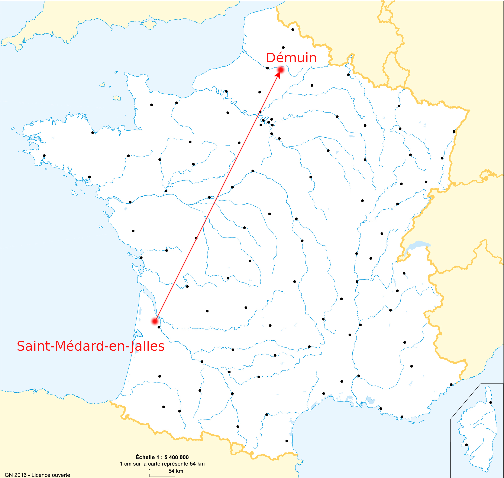
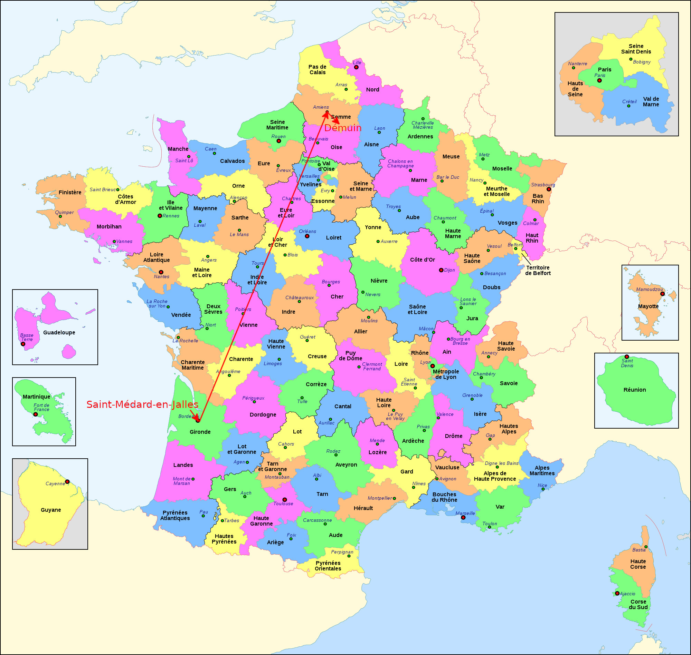
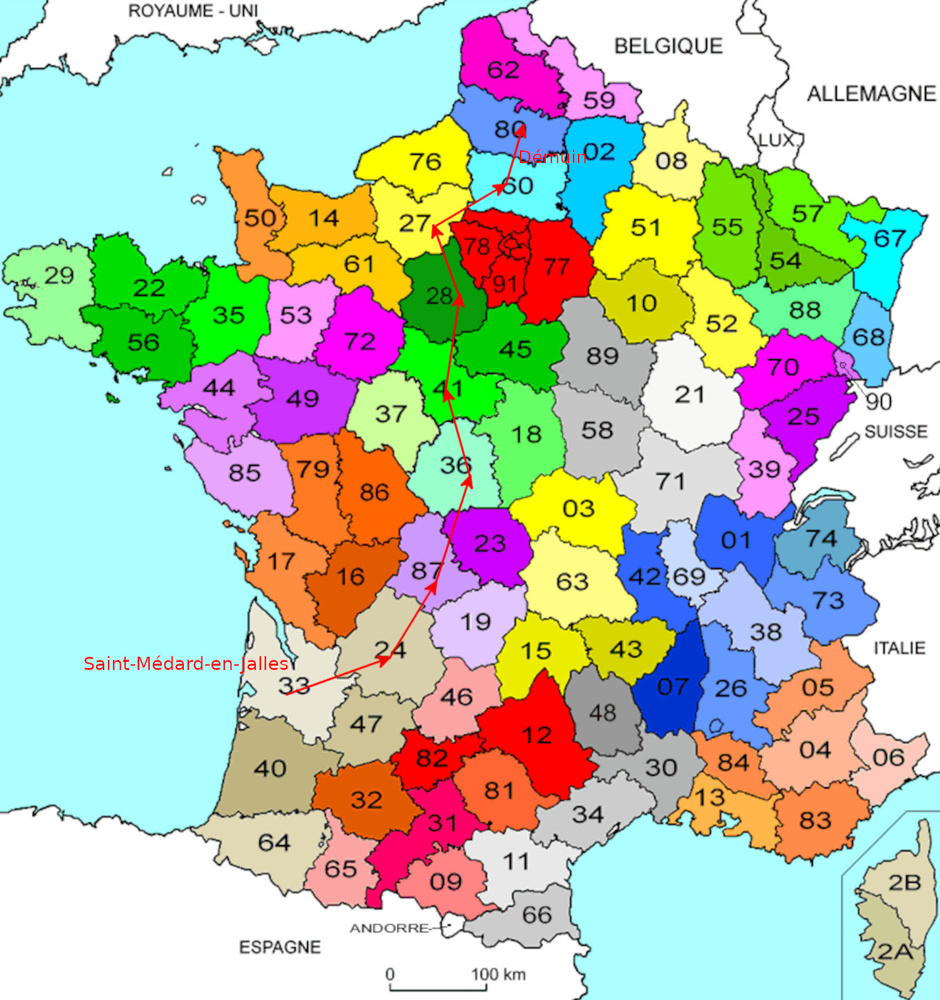
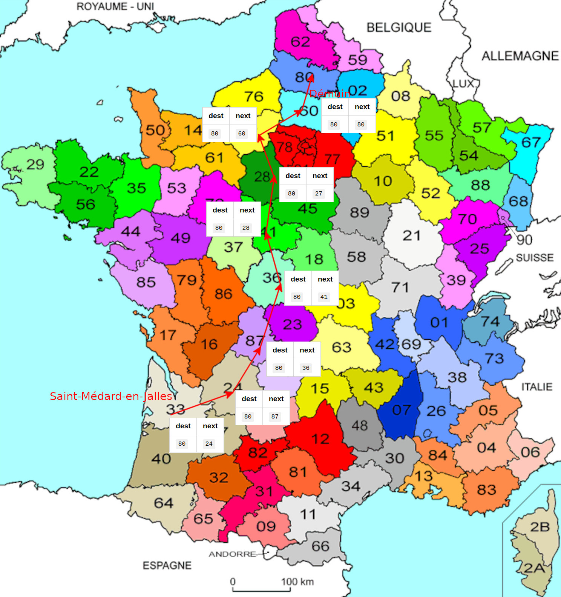

# Comprendre le réseau quand on y connaît vraiment rien

- [Comprendre le réseau quand on y connaît vraiment rien](#comprendre-le-réseau-quand-on-y-connaît-vraiment-rien)
  - [Notions couvertes](#notions-couvertes)
  - [L'analogie de la remise de courrier](#lanalogie-de-la-remise-de-courrier)
    - [Avertissement](#avertissement)
    - [Hypothèses de départ](#hypothèses-de-départ)
    - [Algorithme de remise de courrier primitif](#algorithme-de-remise-de-courrier-primitif)
    - [Algorithme de courrier amélioré : la commutation](#algorithme-de-courrier-amélioré--la-commutation)
    - [Algorithme de redirection du courrier : le routage](#algorithme-de-redirection-du-courrier--le-routage)
    - [Le cas spécial des départements d'outre-mer : les sous-réseaux](#le-cas-spécial-des-départements-doutre-mer--les-sous-réseaux)

## Notions couvertes

Le but de cet article est de comprendre les notions fondamentales d'un réseau TCP/IP.

- Commutation de datagrammes
- Routage de datagrammes
- Adresse IP
- CIDR et masque de sous-réseau
- BGP
- TCP

## L'analogie de la remise de courrier

### Avertissement

Le système postal que nous allons décrire ici est imaginé à des fins **pédagogiques**. Bien que ressemblant au vrai système postal, il est totalement **fictif**. Si le sujet, vous intéresse, je vous invite à consulter la page Wikipedia https://fr.wikipedia.org/wiki/Code_postal_en_France.

### Hypothèses de départ

Pour comprendre la remise d'un paquet d'un ordinateur à un autre, nous pouvons le comparer à la remise d'un courrier par le service postal.

Nous allons donc imaginer la mise en place d'un service postal fictif à l'échelle de la France.

Imaginons une personne qui doit envoyer un courrier depuis Saint-Médard-en-Jalles (`33160`) vers Démuin (`80110`). Pour simplifier l'analogie, nous allons simplement considérer la remise de courrier entre deux communes avec leurs codes postaux respectifs. Le courrier doit d'abord être déposé dans la boite au lettre de la commune où il sera pris en charge par le système postal qui sera en charge de l'acheminer dans la boite au lettre de la commune de destination.

Pour rappel, un code postal est constitué d'un numero de département par ses 2 premiers digits, puis d'un identifiant de commune sur les 3 derniers digits.

| Commune                | Code postal | Département | Identifiant de commune |
| ---------------------- | ----------- | ----------- | ---------------------- |
| Saint-Médard-en-Jalles | `33160`     | `33`        | `160`                  |
| Démuin                 | `80110`     | `80`        | `110`                  |

Sur l'enveloppe au départ de Bordeaux, nous indiquons simplement le code postal de la commune de destination, et au dos nous écrivons notre propre code postal pour que le destinataire puisse nous répondre.

Exemple de courrier à envoyer :

|              | Commune                | Code postal |
| ------------ | ---------------------- | ----------- |
| Expéditeur   | Saint-Médard-en-Jalles | 33160       |
| Destinataire | Démuin                 | 80110       |

### Algorithme de remise de courrier primitif

Voici donc notre premier algorithme sans aucune contrainte :

1. Je met l'enveloppe dans la boite aux lettres de Saint-Médard-en-Jalles
2. Un facteur récupère l'enveloppe et la transporte jusqu'à la boite aux lettres de Démuin
3. Mon destinataire récupère l'enveloppe dans la boite aux lettres de Démuin

Voici le trajet qui sera effectué par notre courrier :

Avec cet algorithme, il faut effectuer autant de trajet qu'il y a de courrier à remettre. Dans le cadre de l'analogie un réseau câblé, cela signifierai qu'il faut établir des câbles réseaux entre chaque communes de la carte, soit pour $N$ communes, nous aurions besoin de $N^N$ câbles.

### Algorithme de courrier amélioré : la commutation

Pour optimiser la remise de nos courriers, nous allons découper la France en départements, et chaque département disposera d'un "bureau distributeur" en charge de récupérer tous les courriers en partance de son département. Pour faciliter la numérotation, la commune du bureau distributeur aura un code postal un peu spécial composé du numéro du département puis de `000`.

Une fois le courrier au bureau distributeur, il existe 2 choix :

- Si le destinataire est dans le même département, alors le courrier lui est directement remis
- Si le destinataire est dans un autre département, alors le courrier est remis au bureau distributeur du département dans lequel se trouve le destinataire.

Avec ces nouveaux éléments, l'algorithme est modifié:

1. Je met l'enveloppe dans la boite aux lettres de Saint-Médard-en-Jalles
2. Un facteur récupère l'enveloppe et la transporte jusqu'au bureau distributeur du département
3. Un facteur récupère l'enveloppe au bureau distributeur
4. Mon destinataire récupère l'enveloppe dans la boite aux lettres de Démuin

Voici le nouveau trajet effectué par le courrier :

Voici la liste des nouveaux codes postaux maintenant impliqués :

|                     | Commune                | Code postal |
| ------------------- | ---------------------- | ----------- |
| Expéditeur          | Saint-Médard-en-Jalles | `33160`     |
| Bureau Gironde (33) | Bordeaux               | `33000`     |
| Bureau Sommes (80)  | Amiens                 | `80000`     |
| Destinataire        | Démuin                 | `80110`     |

Si on regarde l'algorithme du point de vue des codes postaux :

1. L’expéditeur dépose le courrier en partance dans la boite aux lettres `33160`
2. Le courrier est automatiquement acheminé dans la boite aux lettres `33000`
3. Lors du tri du courrier, on extrait le département destinataire et on calcule le code postal du département `80` à partir du code postal du destinataire `80110`, et en fait transiter le courrier jusqu'à la boite au lettres `80` + `000` = `80000`
4. Le courrier est ensuite acheminé de la boite `80000` vers la boite destinataire `80110`

> Dans l'analogie avec un réseau câblé, le bureau distributeur est appelé un **commutateur**. Dans un véritable réseau IP, cet appareil est appelé un **switch**.

Bien que nous ayons déjà optimisé notre système postal, il reste encore à trouver une optimisation pour acheminer le courrier entre chaque bureau distributeur. en effet, dans l'état actuel de notre algorithme, pour $M$ bureaux distributeur, nous aurions besoin de $M^M$ câbles pour relier tous les bureaux distributeurs entre eux.

### Algorithme de redirection du courrier : le routage

Dans cette nouvelle version de notre système postal, nous allons maintenant considérer que les bureaux distributeurs ne peuvent remettre du courrier **uniquement** aux bureaux distributeurs des **départements limitrophes**.

Parcours de notre courrier avec la nouvelle contrainte :

Pour que le nouvel algorithme fonctionne, chaque bureau distributeur doit avoir un tableau pré-calculé de tous les départements possibles associé avec le département limitrophe vers lequel envoyer le courrier. Chaque département parcouru possède également sa propre liste.

Exemple de tableau des redirections connues du département `33` :

| Département destinataire | Département de transit |
| ------------------------ | ---------------------- |
| `85`                     | `17`                   |
| `79`                     | `24`                   |
| `86`                     | `16`                   |
| `16`                     | `16`                   |
| `87`                     | `24`                   |
| `19`                     | `24`                   |
| `24`                     | `24`                   |
| `46`                     | `24`                   |
| ...                      | ...                    |
| `80`                     | `24`                   |

Voici comment fonctionne ce tableau : lors de l’expédition d'un courrier depuis le départements `33` à destination du département `87`, on sait que le plus court chemin est par le département `24` donc on transmet le courrier au bureau distributeur du département `24`, qui transmettra alors directement au bureau distributeur du département `87` qui lui est limitrophe.

Chaque département traversé possède donc son propre tableau optimisé des départements associé au département limitrophe vers lequel envoyer le courrier. Si jamais un bureau d'un département se mettait subitement en grève, le tableau des département limitrophes serait alors recalculé. En France, il y a très souvent au moins 2 département limitrophes, donc on peut facilement trouver un moyen de contourner le département en grève. De la même façon, on peut imaginer associer un *poids* à chaque route. Par exemple, un département montagneux pourra avoir un poids plus élevé qu'un département en plaine. L'algorithme prendra alors en compte ces paramètres afin de calculer le prochain département.

Avec cet algorithme de redirection de proche en proche :

1. L’expéditeur dépose le courrier en partance dans la boite aux lettres `33160`
2. Le courrier est automatiquement acheminé dans la boite aux lettres `33000`
3. On cherche dans la table de routage le meilleur département limitrophe pour `80110` : `80`->`24`, on envoie donc le courrier vers `24000`
4. Le courier arrive à `24000` qui cherche dans sa table de routage: `80110` : `80`->`87` et envoie donc le courrier à `87000`
5. Chaque bureau distributeur de département envoie de proche en proche jusqu'au buteau destinataire `8000.`
6. Le courrier est ensuite acheminé de la boite `80000` vers la boite destinataire `80110`

> Dans l'analogie avec un réseau câblé, celui qui redirige le courrier au département suivant est appelé un **routeur**. Dans les véritables réseaux IP, cet appareil est appelé un **router**. Dans notre analogie, les bureaux distributeurs font office de **commutateurs** et de **routeurs** mais dans les réseaux IP, ce sont des appareils différents.

Ce système de routage a beaucoup d'avantages :

- Une fois le tableau de redirection calculé, il n'y a pas besoin d'autorité centrale pour prendre les décision d'itinéraire. Le système est ainsi extrêmement résiliant.
- Le système n'a pas besoin de l'historique de passage d'un courrier dans les différent département. L'enveloppe de courrier n'a pas besoin d'être modifiée pendant son parcours
- Le système peut stocker plusieurs routes possibles pour une même destination, et il peut aussi s'adapter à l'ajout et la suppression de département intermédiaires.

### Le cas spécial des départements d'outre-mer : les sous-réseaux

Lors du rattachement des départements d'outre-mer au système postal français, il s'est posé la question de l'attribution de nouveaux code postaux à ces départements. Malheureusement, la France commençait à ne **plus avoir assez de numéros de département disponibles**! Il aurait été possible modifier le système pour le faire passer sur 6 digits afin de pouvoir créer des numero de département sur 3 digits, mais ce genre de changement est généralement très couteux. Par chance, ces départements étaient généralement des petits territoires avec assez peu de communes.

Il a donc été trouvé une solution plus simple qui résolvait tous ces problèmes tout en gardant le code postal sur 5 digits : "étendre" à 3 digits le numero du département, et "réduire" à 2 digits l'identifiant de la commune. En faisant ce choix, nous sommes par contre limité à identifier moins de 99 communes par département.

| commune        | Code postal | Département | commune |
| -------------- | ----------- | ----------- | ------- |
| Trois-Rivières | `97114​`    | `971`       | `14`    |
| Saint-Paul     | `97460​`    | `974`       | `60`    |

Pour 