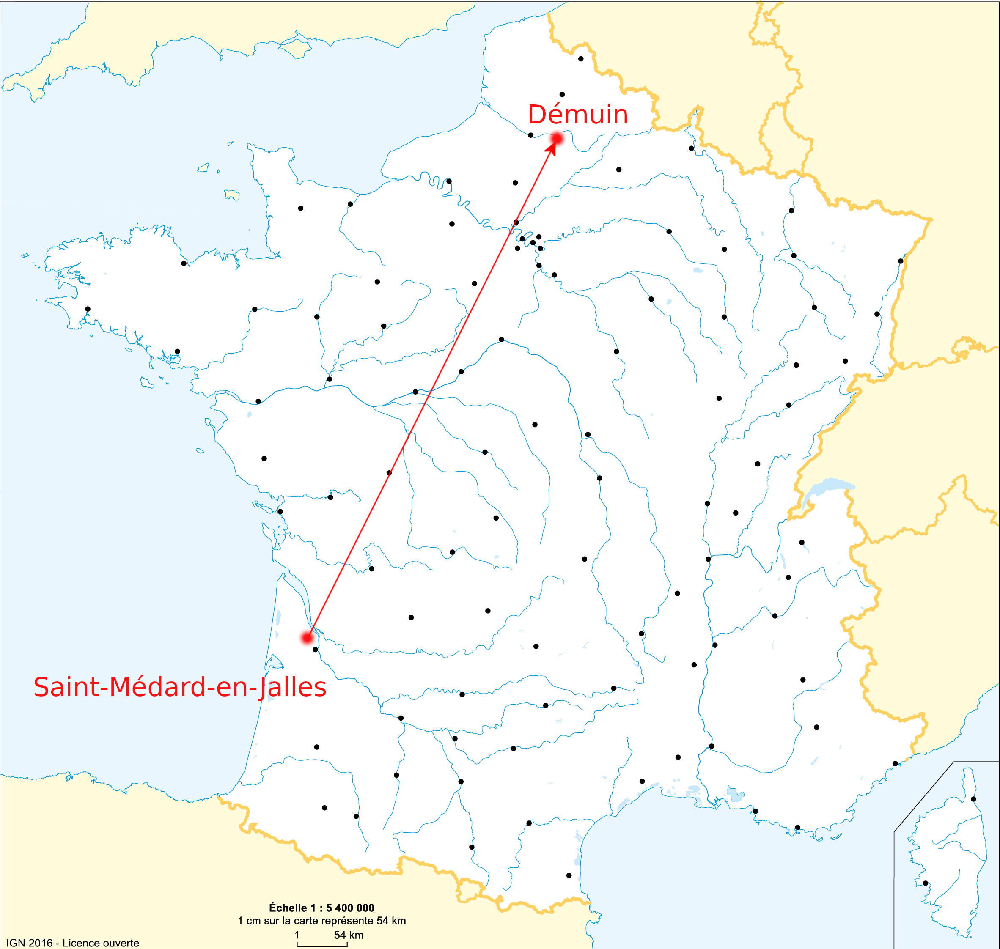
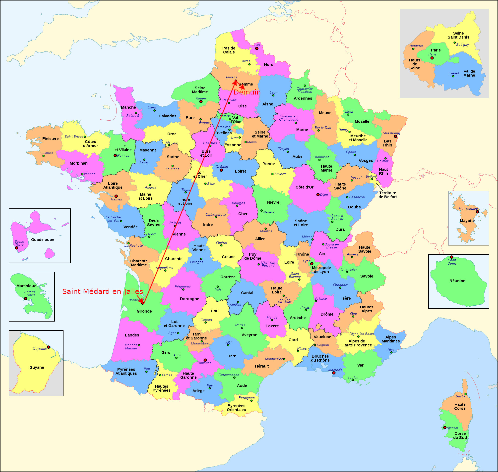
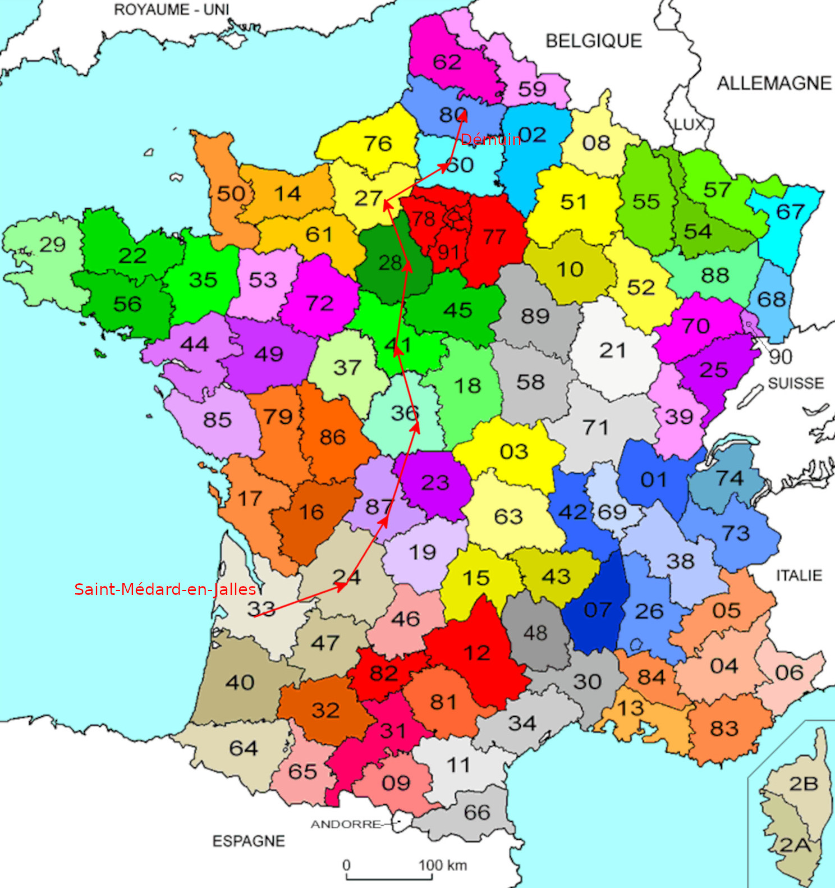
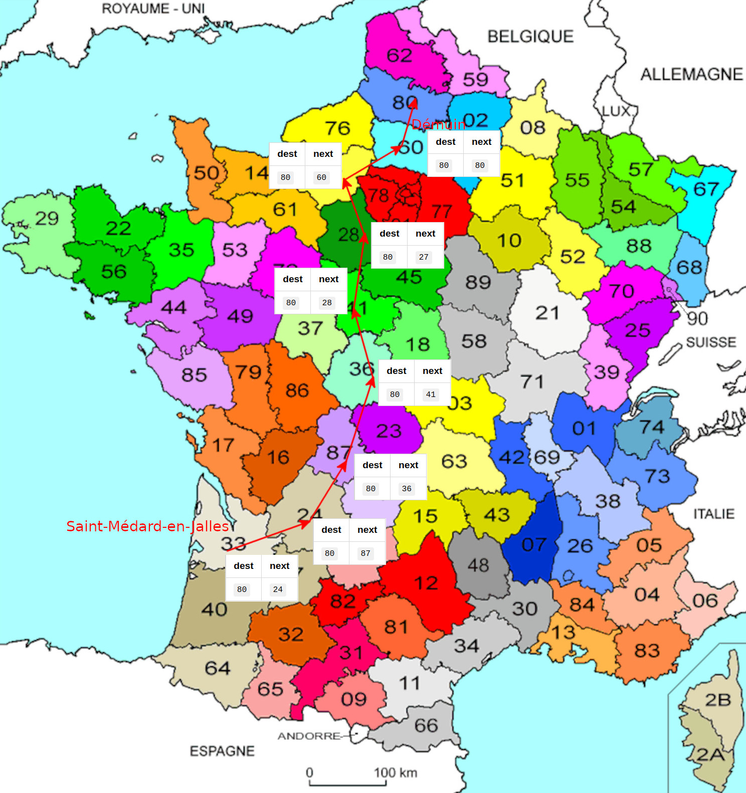
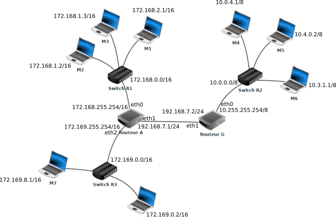

# Comprendre le procole IP quand on est pas un administrateur réseau.

- [Comprendre le procole IP quand on est pas un administrateur réseau.](#comprendre-le-procole-ip-quand-on-est-pas-un-administrateur-réseau)
  - [Introduction](#introduction)
  - [L'analogie de la remise de courrier](#lanalogie-de-la-remise-de-courrier)
    - [Hypothèses de départ](#hypothèses-de-départ)
    - [Algorithme de remise de courrier primitif](#algorithme-de-remise-de-courrier-primitif)
    - [Algorithme de centralisation du courrier : la commutation](#algorithme-de-centralisation-du-courrier--la-commutation)
    - [Algorithme d'acheminement du courrier : le routage](#algorithme-dacheminement-du-courrier--le-routage)
    - [Le cas spécial des départements d'outre-mer : modification de la composition du code postal](#le-cas-spécial-des-départements-doutre-mer--modification-de-la-composition-du-code-postal)
  - [Application des notions précédentes aux réseaux IP (Internet Protocol)](#application-des-notions-précédentes-aux-réseaux-ip-internet-protocol)
  - [Les nœuds du réseau](#les-nœuds-du-réseau)
    - [Le paquet de données](#le-paquet-de-données)
    - [L'adresse IP](#ladresse-ip)
    - [Configuration des appareils](#configuration-des-appareils)
    - [Configuration des switchs](#configuration-des-switchs)
    - [Configuration des routeurs](#configuration-des-routeurs)
    - [Le sous-réseau](#le-sous-réseau)
    - [Les paquets spéciaux ICMP](#les-paquets-spéciaux-icmp)
    - [Le _Time To Live_](#le-time-to-live)
    - [Exemple d'architecture réseau](#exemple-darchitecture-réseau)
  - [Conclusion](#conclusion)

## Introduction

Alors que la plupart d'entre nous ne sont pas des experts réseau, il arrive souvent aux développeurs d'application de devoir envoyer ou recevoir des données sur le réseau. La plupart du temps, la seule connaissance nécessaire est de savoir ouvrir un `socket` réseau. Mais en cas de problème, un novice sera démuni pour comprendre un message d'erreur ou vérifier la configuration d'un serveur.

La plupart des explications qu'on peut trouver sur Internet se concentrent un peu trop rapidement sur l'aspect profond, comme la manipulation de _bits_, la spécification des _headers_ ou la définition des couches _OSI_... Je suis persuadé qu'il est possible de saisir le fonctionnement général d'un réseau IP sans avoir besoin de savoir d'entrer dans les arcanes des cartes réseaux. Je vous propose donc ici une vision **vulgarisée** d'un réseau IP, donc forcement simplifiée et incomplète.

Avec ces quelques explications, vous serez mieux préparés pour discuter avec un expert réseau ou mieux comprendre certains messages d'erreurs renvoyés par votre application.

Dans cet article, nous allons aborder les notions qui permettrons de répondre simplement à des questions comme :

- _Quand je tape la commande `ping`, qu'est-ce que je teste en réalité ?_
- _Pourquoi dit-on que Internet est décentralisé et robuste ?_
- _Ma box internet, c'est un switch ou un routeur?_
- _J'ai un nouveau PC, mais je ne sais jamais quoi mettre dans "Adresse de sous-réseau" et "Passerelle par defaut" !!!_

## L'analogie de la remise de courrier

Pour comprendre la remise d'un paquet d'un ordinateur à un autre, nous allons imaginer la remise remise d'un courrier par le service postal.

> Le système postal que nous allons décrire ici est imaginé à des fins **pédagogiques**. Bien que ressemblant au vrai système postal, il est totalement **fictif**. Si le sujet vous intéresse, je vous invite à consulter la page Wikipedia <https://fr.wikipedia.org/wiki/Code_postal_en_France>.

### Hypothèses de départ

Nous allons donc imaginer la mise en place d'un service postal fictif simplifié à l'extrême :

- Il n'y a qu'une seule boite au lettre par commune
- Chaque boite au lettre est identifié par son code postal uniquement

Imaginons une personne qui doit envoyer un courrier depuis Saint-Médard-en-Jalles (`33160`) vers Démuin (`80110`). Le courrier est d'abord être déposé dans la boite aux lettres de la commune où il sera pris en charge par le système postal qui sera en charge de l'acheminer dans la boite aux lettres de la commune de destination.

Un code postal est constitué d'un numéro de département par ses 2 premiers digits, puis d'un identifiant de commune sur les 3 derniers digits.

| Commune                | Code postal | Département | Identifiant de commune |
| ---------------------- | ----------- | ----------- | ---------------------- |
| Saint-Médard-en-Jalles | `33160`     | `33`        | `160`                  |
| Démuin                 | `80110`     | `80`        | `110`                  |

Sur l'enveloppe au départ de Saint-Médard-en-Jalles, nous indiquons simplement le code postal de la commune de destination, et au dos nous écrivons notre propre code postal pour que le destinataire puisse nous répondre.

Exemple de courrier à envoyer :

|              | Commune                | Code postal |
| ------------ | ---------------------- | ----------- |
| Expéditeur   | Saint-Médard-en-Jalles | 33160       |
| Destinataire | Démuin                 | 80110       |

### Algorithme de remise de courrier primitif

Voici donc notre premier algorithme sans aucune contrainte :

1. Je dépose l'enveloppe dans la boite aux lettres de Saint-Médard-en-Jalles
2. Un facteur récupère l'enveloppe et la transporte jusqu'à la boite aux lettres de Démuin
3. Mon destinataire récupère l'enveloppe dans la boite aux lettres de Démuin

Voici le trajet qui sera effectué par notre courrier :

Cet algorithme n'est pas optimal, car il faut effectuer **autant de trajet qu'il y a de courriers à remettre**.

Dans le cadre de l'analogie un réseau câblé, cela signifierait qu'il faut établir des câbles réseaux entre chaque commune de la carte, soit pour $N$ communes, nous aurions besoin d'un ordre de grandeur de $N^N$ câbles.

### Algorithme de centralisation du courrier : la commutation

Pour optimiser la remise de nos courriers, nous allons découper la France en départements, et chaque département disposera d'un unique "bureau distributeur" en charge de récupérer tous les courriers en partance ou à destination de son département. Cette première étape permettra de rassembler tous les courriers du département pour les trier selon leurs destinations, et pouvoir ainsi grouper les courriers que l'on doit emmener au même bureau distributeur de destination.

Pour faciliter la numérotation, la commune du bureau distributeur aura un code postal un peu spécial composé du numéro du département puis de `000`.

Une fois le courrier au bureau distributeur, il existe 2 choix :

- Si le destinataire est dans le même département, alors le courrier lui est directement remis
- Si le destinataire est dans un autre département, alors le courrier est remis au bureau distributeur du département dans lequel se trouve le destinataire.

Avec ces nouveaux éléments, l'algorithme est modifié:

1. Je dépose l'enveloppe dans la boite aux lettres de Saint-Médard-en-Jalles
2. Un facteur récupère l'enveloppe et la transporte jusqu'au bureau distributeur du département
3. Un facteur récupère l'enveloppe au bureau distributeur
4. Mon destinataire récupère l'enveloppe dans la boite aux lettres de Démuin

Voici le nouveau trajet effectué par le courrier :

Voici la liste des nouveaux codes postaux traversés :

|                     | Commune                | Code postal |
| ------------------- | ---------------------- | ----------- |
| Expéditeur          | Saint-Médard-en-Jalles | `33160`     |
| Bureau Gironde (33) | Bordeaux               | `33000`     |
| Bureau Sommes (80)  | Amiens                 | `80000`     |
| Destinataire        | Démuin                 | `80110`     |

Si on regarde l'algorithme du point de vue des codes postaux :

1. L’expéditeur dépose le courrier en partance dans la boite aux lettres `33160`
2. Le courrier est automatiquement acheminé dans la boite aux lettres `33000`
3. Lors du tri du courrier, on extrait le département destinataire et on calcule le code postal du département `80` à partir du code postal du destinataire `80110`, et en fait transiter le courrier jusqu'à la boite aux lettres `80` + `000` = `80000`
4. Le courrier est ensuite acheminé de la boite `80000` vers la boite destinataire `80110`

> Dans l'analogie avec un réseau IP, le bureau distributeur est appelé un **commutateur** (ou **switch** en anglais).

Mais il reste encore à trouver une optimisation pour acheminer le courrier entre chaque bureau distributeur. En effet, dans l'état actuel de notre algorithme, pour $M$ bureaux distributeur, nous aurions besoin d'un ordre de grandeur de $M^M$ câbles pour relier tous les bureaux distributeurs entre eux.

### Algorithme d'acheminement du courrier : le routage

Dans cette nouvelle version de notre système postal, nous allons maintenant considérer que les bureaux distributeurs vont pouvoir remettre du courrier aux bureaux distributeurs de leurs **départements limitrophes**, qui devront à leur tour transporter le courrier à un autre département limitrophe. Le courrier finira par arriver au bureau distributeur de destination en traversant chaque département de proche en proche.

Avec ce système, les bureaux distributeurs ne sont plus des simples centralisateurs, mais deviennent des membres actif du réseau postal dans son ensemble. Chaque bureau distributeur doit alors trier les courriers provenant de son propre département mais aussi les courriers en "transit" en provenance des autres département.

Parcours de notre courrier avec la nouvelle contrainte :

Ce mécanisme semble avoir beaucoup d'avantages, car les bureaux distributeurs n'ont plus besoin de connaître l'ensemble des départements, mais il a un inconvénient **majeur** : comment savoir vers quel département suivant envoyer le courrier pour qu'il finisse par arriver au bon département de destination ? Et comment faire en sorte que ce parcours soit optimal, sans traverser des départements inutiles, ni créer des boucles ?

Pour que le système fonctionne, chaque bureau distributeur doit recevoir à l'avance un "tableau des redirections" **pré-calculé** de tous les départements possibles associé avec le département limitrophe vers lequel envoyer le courrier. Ainsi, lorsqu'un bureau distributeur reçoit un courrier, il lit le code postal de destination, en déduit le département de destination puis cherche dans le tableau le prochain département vers lequel faire transiter ce courrier.

Exemple de tableau des redirections attribué au département `33` :

| Département destinataire | Département de transit |
| ------------------------ | ---------------------- |
| `85`                     | `17`                   |
| `79`                     | `24`                   |
| `86`                     | `16`                   |
| `16`                     | `16`                   |
| `87`                     | `24`                   |
| `19`                     | `24`                   |
| `24`                     | `24`                   |
| `46`                     | `24`                   |
| ...                      | ...                    |
| `80`                     | `24`                   |

Appliquons ce tableau à notre exemple : lors de l’expédition d'un courrier depuis le département `33` à destination du département `80`, on sait que le plus court chemin est par le département `24` donc on transmet le courrier au bureau distributeur du département `24`, qui le prendra en charge pour la suite.

Chaque département traversé possède donc son propre tableau optimisé des départements associé au département limitrophe vers lesquels envoyer le courrier. Si jamais un bureau d'un département était subitement fermé, le tableau des départements limitrophes serait alors recalculé. En France, il y a très souvent au moins 2 départements limitrophes, donc on peut facilement trouver un moyen de contourner le département fermé. De la même façon, on peut imaginer associer une préférence (un _poids_) à chaque route. Par exemple, un département montagneux pourra avoir un poids moins élevé qu'un département en plaine. L'algorithme prendra alors en compte ces paramètres afin de calculer le prochain département.

Avec cet algorithme de redirection de proche en proche :

1. L’expéditeur dépose le courrier en partance dans la boite aux lettres `33160`
2. Le courrier est automatiquement acheminé dans la boite aux lettres `33000`
3. On cherche dans la table de routage le meilleur département limitrophe pour `80110` : `80`->`24`, on envoie donc le courrier vers `24000`
4. Le courrier arrive à `24000` qui cherche dans sa table de routage : `80110` : `80`->`87` et envoie donc le courrier à `87000`
5. Chaque bureau distributeur de département envoie de proche en proche jusqu'au bureau destinataire `8000.`
6. Le courrier est ensuite acheminé de la boite `80000` vers la boite destinataire `80110`

> Dans l'analogie avec un réseau IP, celui qui redirige le courrier au département suivant est appelé un **routeur** (ou **router** en anglais).
> Dans notre analogie, les bureaux distributeurs font office à la fois de **commutateurs** et de **routeurs** mais dans les réseaux IP, ce sont des appareils différents comme nous le verrons dans le chapitre suivant.

Ce système de routage a beaucoup d'avantages :

- Une fois le tableau de redirection calculé, il n'y a pas besoin d'autorité centrale pour prendre les décisions d'itinéraire. Le système est ainsi extrêmement résiliant.
- Les bureaux distributeurs n'ont pas besoin de garder en mémoire qu'un courrier est passé par leur département. Il le passe à son voisin et l'oublie.
- L'enveloppe de courrier n'a pas besoin d'être modifiée pendant son parcours.
- Le système peut choisir plusieurs routes possibles pour une même destination, et il peut aussi s'adapter à l'ajout et la suppression de département intermédiaires.

### Le cas spécial des départements d'outre-mer : modification de la composition du code postal

Lors du rattachement des départements d'outre-mer au système postal français, il s'est posé la question de l'attribution de nouveaux codes postaux à ces départements. Malheureusement, la France commençait à ne **plus avoir assez de numéros de département disponibles** ! Il aurait été possible modifier le système pour le faire passer sur 6 digits afin de pouvoir créer des numéros de département sur 3 digits, mais ce genre de changement est généralement très coûteux.

Par chance, ces départements étaient généralement des petits territoires avec assez peu de communes. Il a donc été trouvé une solution plus simple qui résolvait tous ces problèmes tout en gardant le code postal sur 5 digits :

1. **Réserver** le code `97` à l'ensemble des département d'outre-mer
2. **Augmenter à 3 digits le code du département, et "réduire" à 2 digits l'identifiant de la commune**.

Grâce à cette idée, nous gardons le format du code postal sur 5 digits, mais en contrepartie, nous sommes limités à identifier moins de 99 communes par département.

| Commune                | Code postal | Département | Commune |
| ---------------------- | ----------- | ----------- | ------- |
| Saint-Médard-en-Jalles | `33160`     | `33`        | `160`   |
| Démuin                 | `80110`     | `80`        | `110`   |
| Trois-Rivières         | `97114​`    | `971`       | `14`    |
| Saint-Paul             | `97460​`    | `974`       | `60`    |

Pour adapter ces nouveaux identifiants aux systèmes de **commutation** et de **routage** existant, c'est assez simple :

- Au niveau de chaque commune, on doit stocker un nouveau paramètre qui permet de calculer le centre distributeur du département.

| Code postal de la commune | Nombre de digit identifiant le département | Code postal du bureau distributeur |
| ------------------------- | ------------------------------------------ | ---------------------------------- |
| `33160`                   | 2                                          | `33000`                            |
| `80110`                   | 2                                          | `80000`                            |
| `97114​`                  | 3                                          | `97100`                            |
| `97460​`                  | 3                                          | `97400`                            |

- Au niveau des bureaux de distribution, on doit également connaître le nombre de digits à enlever pour connaître le département correspondant. L'algorithme lui ne change pas, il manipule uniquement des nombres plus grands.

| Code postal de la commune | Nombre de digit identifiant le département | Département |
| ------------------------- | ------------------------------------------ | ----------- |
| `33160`                   | 2                                          | `33`        |
| `80110`                   | 2                                          | `80`        |
| `97114​`                  | 3                                          | `971`       |
| `97460​`                  | 3                                          | `974`       |

> Dans l'analogie avec un réseau IP, le nombre de digit identifiant le département est appelé un **masque de sous-réseau** (**subnet mask** ou **netmask** en anglais).

## Application des notions précédentes aux réseaux IP (Internet Protocol)

## Les nœuds du réseau

Tous les appareils ayant une ou plusieurs cartes réseaux sont appelés des **nœuds du réseau**. Ils possèdent une adresse IP pour communiquer entre eux. Les ordinateurs, les smartphones, les serveurs , et même les routeurs, sont tous des nœuds de notre réseau.

Les développeurs vont plus naturellement travailler sur les **nœuds périphériques** du réseau, autrement dit les nœuds portant l'application, soit un client ou un serveur.

Pour la suite, nous utiliserons le terme générique d'**appareil** (_device_ en anglais) pour désigner les **nœuds périphériques**. Dans notre système postal, ces appareils sont donc les communes ayant un code postal.

### Le paquet de données

Lorsque 2 appareil du réseau veulent communiquer, ils doivent s'envoyer une certaine quantité de données. Pour commencer, les données vont être d'abord découpées en petits morceaux de plus petites tailles appelés **paquets** (on parle aussi de _datagrammes_).

Au dessus de chaque petit paquet de données, on ajoute des informations supplémentaires, comme l'adresse de destination et l'adresse de retour, ainsi que d'autres données utiles à la transmission. On dit alors que l'on _encapsule_ les données, ou encore que l'on rajoute un _entête_ au paquet.

> C'est l'équivalent de mettre un courrier dans une enveloppe dans l'exemple du service postal.

Ils sont ensuite envoyés sur le réseau et transitent au travers des **switchs** et **routeurs** rencontrés pendant son trajet. Tous les paquets ne vont pas forcement emprunter les mêmes chemin, et le destinataire reçoit ces petits paquets potentiellement dans le désordre. Charge au destinataire de rassembler les données dans l'ordre pour reconstituer le message originel.

### L'adresse IP

Il peut y avoir une très grande quantité d'appareils sur le réseau et chaque appareil doit avoir une adresse unique, il faut donc que les adresses soit assez nombreuses pour qu'Internet puisse fonctionner.

Le protocole IP (pour _Internet Protocol_, que l'on pourrait traduire par _protocole inter-réseau_), est le protocole qui va permettre la remise d'un paquet de donnés à une adresse du réseau.

Les adresses d'un réseau IP sont simplement une suite d'octets.

Il existe aujourd'hui deux versions du protocoles IP : IPv4 et IPv6. Ces protocoles sont incompatibles entre eux, n'utilisent pas le même format d'adresse et qui ont des entêtes et un fonctionnement légèrement différent.

- Une adresse IP dans IPv4 est constituée de 32 bits et peut donc décrire $2^{32}$ addresses, soit à peu près 4 milliards, ce qui paraissait suffisant lors de sa création. Cependant avec tous les nouveaux usages, ce chiffre a explosé, menaçant même Internet de pénurie d'adresses disponibles.

- Une adresse IP dans IPv6 est constituée de 128 bits et peut donc décrire $2^{128}$ addresses, soit à peu près 340 sextillions. Ce protocole a été créé pour résoudre les limites de IPv4, et au passage lui ajouter quelques fonctionnalités, notamment pour augmenter la sécurité.

| Type         | Exemple                                   |
| ------------ | ----------------------------------------- |
| Code postal  | `33160`                                   |
| Adresse IPv4 | `193.43.55.67`                            |
| Adresse IPv6 | `2001:0db8:0000:85a3:0000:0000:ac1f:8001` |

Pour faciliter la lecture, on utilise une représentation décimale de chaque octet séparés par des points pour IPv4 et hexadécimale par groupe de 4 octets séparés par des deux points pour les adresses IPv6.

Plus complet (et plus complexe !), IPv6 est sensé remplacer IPv4 à terme, mais la migration est difficile car tout le matériel (routeurs, switchs, ...) doit être remplacé. De plus, ces deux protocoles ne sont pas compatibles entre eux, et la migration nécessite de mettre au point des **stratégies de cohabitation** qui ne sont pas toujours simples.

En attendant l'adoption complète de IPv6 pour tout Internet, il existe beaucoup de techniques qui permettent de **contourner les limites actuelles de IPv4**. La technique la plus répandue étant simplement de ne pas connecter des sous-réseaux entiers à Internet. Ces réseaux **privés** peuvent utiliser toute la puissance d'IP tout en s'affranchissant de ses limites tant que les paquets ne sortent pas du réseau. En contrepartie, il faudra user de techniques complexes et/ou limitées pour pouvoir communiquer avec le reste d'Internet (`Proxy`, `NAT`, etc...)

> **Pour des raisons de simplicité, nous continuerons les explication avec IPv4 uniquement**.
> Les notions restent très similaires pour IPv6.

### Configuration des appareils

Pour communiquer sur le réseau, l'administrateur réseau attribue à un appareil une adresse IP du sous-réseau dans lequel il se trouve. La configuration de son adresse est faite directement sur l'appareil. Aucun autre nœud du réseau n'a la liste complète des appareils.

- Lorsqu'il enverra un datagramme, il ajoutera dans les meta-données sa propre adresse comme adresse de retour
- Lorsque des datagrammes arrivent sur son sous-réseau, l'appareil devra les réclamer au switch qui s'occupe de la distribution locale.

> Selon l'analogie avec le système postal, chaque commune connaît son propre code postal

Cela implique que l'administrateur système n'a pas le droit à l'erreur :

- Si l'administrateur attribue à l'appareil une adresse qui ne correspond pas au réseau dans lequel il se trouve, il ne recevra jamais de données
- Si l'administrateur donne la même adresse à 2 appareils du même sous-réseau, les 2 appareil réclameront les mêmes données et il est probable que chacun de ces appareil ne reçoivent que des données tronquées.

Heureusement il existe des techniques pour maintenir un réseau sans se tromper, comme par exemple le `DCHP` qui s'occupera de distribuer de manière unique les adresses aux nouveaux arrivant sur le réseau.

Attention, certains appareils possèdent plusieurs cartes réseaux, chaque carte est considérée comme un appareil indépendant et c'est le système d'exploitation qui devra décider quand envoyer des paquets sur l'une ou l'autre carte.

### Configuration des switchs

Les switchs (ou **commutateurs**) n'ont par défaut aucune configuration. Ils se contentent de distribuer localement les paquets à ceux qui les réclament grâce au **protocole ARP** (Address Resolution Protocol).

Fonctionnement de ARP :

1. Le switch reçoit un paquet sur un de ces "ports" (carte réseau connecté à une autre carte réseau par un cable, à ne pas confondre avec la notion de "port" de `TCP` ou `UDP`) à destination d'une adresse IP
2. Le switch envoie un message spécial à **tous** ses ports actifs pour demander à qui appartient l'adresse IP de destination
3. L'appareil qui possède cette adresse répond à la demande en se désignant lui-même. Pendant cet appel, un routeur peux aussi répondre si la destination est sur un autre réseau !
4. Le switch envoie le paquet sur le câble de celui qui a répondu
5. Pendant un laps de temps défini, il va garder en mémoire cette association pour ne pas redemander trop souvent (on parle de **cache ARP**)

En réalité, les switchs modernes ont des configurations qui peuvent être plus complexes, comme par exemple la possibilité de créer des sous-réseaux virtuels étalés entre plusieurs switchs : les VLAN (Virtual Local Area Network)

> Selon l'analogie avec le système postal, les switchs sont les bureaux de distribution locaux, ils récupèrent les courriers des communes ou distribuent le courrier aux communes

### Configuration des routeurs

Un routeur ne connaît en premier que les adresses des sous-réseaux qui lui sont directement connectés par ses câbles. Lorsqu'un routeur reçoit un paquet, il doit donc prendre une décision :

- Si l'adresse contient un sous-réseau qui lui est directement connecté, il recopie directement le paquet vers le réseau de destination.
- Si l'adresse n'est pas sur un de ses sous-réseaux, il consulte sa table de routage pour déterminer le prochain routeur le plus proche de sa destination.
- Si l'adresse n'est dans aucun des réseaux connus ni dans sa table de routage, il peut décider de l'envoyer vers une _route par defaut_ (_Default Gateway_). Mais peut également être aussi configuré pour refuser de transmettre le paquet plus loin. Dans ce cas, le paquet est considéré comme perdu.

Les tables de routage de chaque routeur peuvent être configurées manuellement sur des petits réseaux, mais plus généralement on utilisera des protocoles de construction dynamique des tables de routage, comme `BGP` ou `OSPF`.

Ces protocoles sont algorithmiquement complexes, car tous les routeurs du réseaux vont demander aux routeurs voisins de leur donner d'information de leur propre configuration. Par un système d'échange de proche en proche, chaque routeur finira par faire converger sa propre table de routage vers un état stable qui prendra en compte l'ensemble des adresses du réseau. Une fois que la configuration a convergé vers une configuration stable, chaque routeur est autonome pour prendre ses décisions de routage. En cas de perte  ou d'ajout d'un routeur sur le réseau, les nouvelles tables de routages seront recalculées.

> Les table de routages correspondent aux tableaux de redirections dans l'analogie avec le système postal. Ils font le travail des bureaux de distribution lors du transfert de courrier vers un département limitrophe.

#TODO: Elle est en revanche cruciale pour l'architecte réseau. En effet, dans le Cloud ou encore plus sur un réseau physique, l'architecte réseau va avoir à sa disposition un réseau qu'il faudra **découper** intelligemment. Par exemple, il faut créer suffisamment de sous-réseaux pour créer des règles d'accès fines (quel sous-réseau aura le droit d'aller vers internet, quel sous-réseau contiendra les bases de données, etc...) tout en gardant assez de "digits" disponibles pour pouvoir créer suffisamment d'adresses à l'intérieur de ces sous-réseaux. De même il faut faire attention à ce que les réseaux ne se "chevauchent" pas.

### Le sous-réseau

Un peu comme pour les codes postaux qui contiennent un numéro de département et un identifiant de commune, une adresse IP contient 2 informations :

- Le **sous-réseau** dans lequel se trouve l'appareil (équivalent du **département**)
- L'**identifiant** de l'appareil au sein de ce réseau (équivalent de l'**identifiant de commune**)

> La notion de sous-réseau se confond souvent avec la notion de réseau, et il n'est pas rare de voir utiliser indifféremment les deux termes. Comme on nous allons le voir, un réseau est toujours le sous-réseau d'un autre réseau !

Si on met côte à côte un code postal et une adresse IP, on peut faire un parallèle :

| Type                         | Adresse complète | Nb de digit du sous-réseau | Sous-réseau   | Nb d'identifiant possibles dans ce sous-réseau |
| ---------------------------- | ---------------- | -------------------------- | ------------- | ---------------------------------------------- |
| Code postal                  | `33160`          | 2                          | `33000`       | 999                                            |
| Code postal d'Outre-mer      | `97114​`         | 3                          | `97100`       | 99                                             |
| Adresse IP d'un petit réseau | `193.43.55.67`   | 24 (en bits !)             | `193.43.55.0` | 254                                            |
| Adresse IP d'un grand réseau | `145.12.149.78`  | 16                         | `145.12.0.0`  | 65534                                          |
| Adresse IP d'un réseau moyen | `52.32.45.65`    | 20                         | `52.32.32.0`  | 4094                                           |

> Sur le dernier exemple du tableau, on comprend qu'il n'est pas toujours facile de calculer les représentations décimales à partir du binaire. C'est pourquoi il existe des outils comme `ipcalc` qui permet des calculs rapides.

Lorsqu'un appareil veut communiquer avec un autre appareil, il n'a besoin que de son adresse IP, par exemple :

`52.32.45.65`

Mais lorsqu’on configure un réseau et que l'on a besoin de connaitre le nombre de digit du sous-réseau, on utilisera la notation CIDR (_Classless Inter-Domain Routing_), c'est un dire un slash `/` suivi du nombre de bits :

`52.32.45.65/20`

Il arrive que l'on trouve encore des anciens systèmes qui se configurent avec un **masque binaire** de sous-réseau. Il s'agit d'une suite de `1` puis de `0` qui permettent de retrouver le sous-réseau par une opération `AND` binaire :

IP: `52.32.45.65`
Masque: `255.255.240.0`

### Les paquets spéciaux ICMP

En plus des paquets de données circulant sur le réseau, il existe des paquets spéciaux ne contenant pas de données à acheminer, mais qui contiennent à la place une information d'état envoyé par les routeurs pour signaler un événement ou répondre à une demande d'état. Ce sont les paquet **ICMP** (_Internet Control Message Protocol_).

Le plus connu est le paquet ICMP de type `echo` : Lorsqu'un nœud du réseau reçoit ce paquet, il se contente de le renvoyer à l'émetteur. C'est le paquet envoyé par la commande bien connue `ping`. Mais c'est probablement le type de paquet ICMP le moins utile en réalité. Il est d'ailleurs souvent bloqué par les firewall, car une commande `echo` peut donner de l'information à un potentiel attaquant, par exemple pour scanner le réseau à la recherche des machines allumées.

En revanche les type de paquet ICMP les plus utiles sont les messages indiquant à l'émetteur qu'une erreur s'est produite pendant l'acheminement d'un paquet de donnée.

Par exemple lorsqu'un paquet arrive sur un routeur et qu'il n'arrive pas à prendre de décision de routage, il supprimera le paquet de sa mémoire, et informera l’expéditeur grâce à un paquet ICMP de type _Destination Unreachable_. Ainsi l'expediteur sera au courant du problème et pourra prendre des mesures.

### Le _Time To Live_

Comme il n'existe pas d'autorité centrale sur le réseau, personne ne sait où se trouve un paquet une fois qu'il est envoyé sur le réseau. Du point de vue des routeurs, chaque paquet est indépendant et il ne garde aucune trace de son passage une fois envoyé au routeur suivant.

Que se passerait-il si par exemple des routeurs mal configurés créaient par erreur un routage excessivement long, ou pire un routage en boucle qui n'arriverait jamais à la destination ?

Pour palier ce problème de confiance, chaque paquet produit par l'émetteur possède dans son entête un nombre entier, nommé **Time To Live** (**Temps restant à vivre**), abrégé `TTL`. A chaque fois qu'un paquet est lu par un routeur et recopier vers un autre réseau, ce nombre est décrémenté de 1. Un routeur qui doit envoyer un paquet avec un `TTL` de 0 le considérera comme perdu et informera l'expéditeur par un paquet ICMP de type _Time Exceeded_

On notera que ici aussi, il est possible de détourner cette noton de `TTL` afin d'obtenir des informations sur les routeurs qu'un paquet traverse jusqu'à sa destination. Par exemple, si je veux connaître l'adresse IP du troisième routeur traversé par mes paquets, je peux forcer le `TTL` à 3. Le troisième routeur traversé verra le `TTL` à 0 et renverra un paquet ICMP avec son adresse dans le champ `source`. C'est exactement le fonctionnement de la commande `traceroute` qui envoie successivement des paquets avec un `TTL` de 1, puis 2, puis 3, etc... Là encore il est facile de bloquer ces types de paquets si l'on considère que c'est une faille de sécurité.

### Exemple d'architecture réseau

## Conclusion

J’espère que l'analogie avec le système postal vous aura aider à comprendre comment un petit paquet de donnée arrive à trouver son chemin au travers d'Internet. Bien sûr il reste beaucoup de concepts que j'ai volontairement passé sous silence pour rester le plus compréhensible possible.

Normalement, à l'issue de cette lecture, vous devriez avoir ressenti un concept important caractéristiques aux réseaux IP et à Internet en particulier : vous devriez avoir mieux compris à quel point cette architecture est si solide grâce à l'absence d'autorité de contrôle central.
